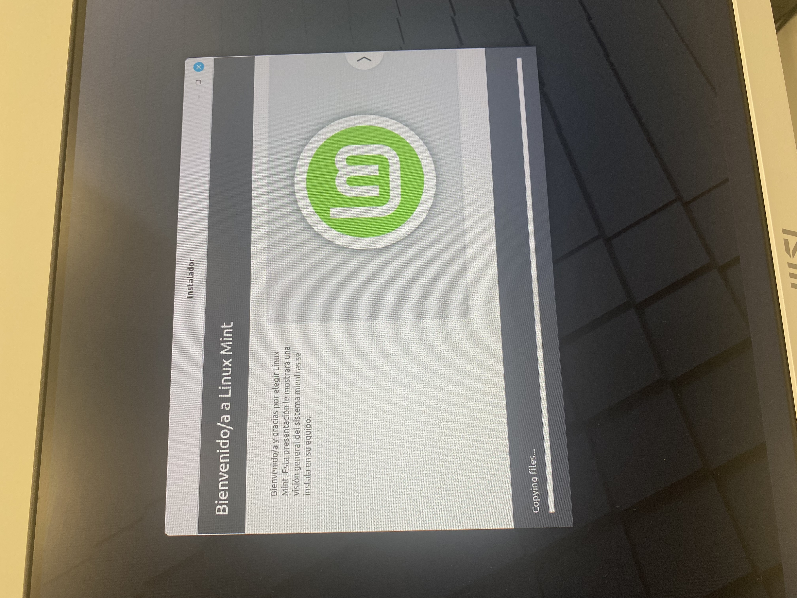
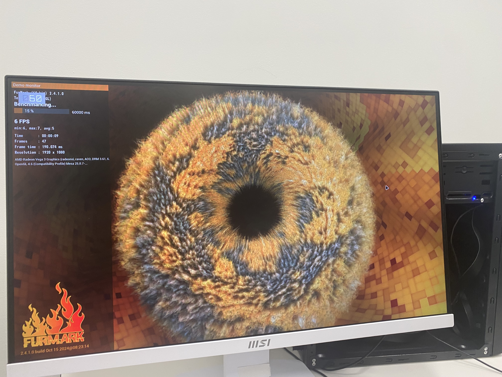
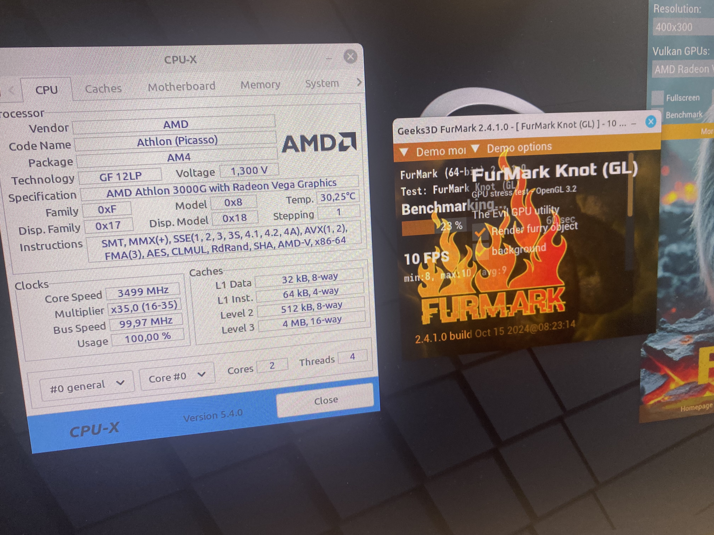

# Grupo Castores S.L.
- [1. Introducción](#1-introducción)
    - [1.1. Descripción del proyecto](#11-descripción-del-proyecto)
    - [1.2. Objetivos del proyecto](#12-objetivos-del-proyecto)
- [2. Análisis del contexto y justificación de la propuesta](#2-análisis-del-contexto-y-justificación-de-la-propuesta)
- [3. Estado del arte](#3-estado-del-arte)
- [4. Requisitos del proyecto](#4-requisitos-del-proyecto)
    - [4.1. Requisitos funcionales](#41-requisitos-funcionales)
    - [4.2. Requisitos no funcionales](#42-requisitos-no-funcionales)
- [5. Planificación](#5-planificación)
    - [5.1. Fases del proyecto](#51-fases-del-proyecto)
    - [5.2. Cronograma de trabajo](#52-cronograma-de-trabajo)
    - [5.3. Recursos necesarios](#53-recursos-necesarios)
- [6. Desarrollo del proyecto](#6-desarrollo-del-proyecto)
    - [6.1. Análisis y diseño](#61-análisis-y-diseño)
    - [6.2. Tecnologías/Herramientas empleadas](#62-tecnologíasherramientas-empleadas)
    - [6.3. Partes contratantes](#63-partes-contratantes)
    - [6.4. Presupuesto](#64-presupuesto)
    - [6.5. OPCIONAL: Contrato y pliego de condiciones](#65-opcional-contrato-y-pliego-de-condiciones)
    - [6.6. OPCIONAL: Análisis de riesgos](#66-opcional-análisis-de-riesgos)
- [7. Pruebas y validación](#7-pruebas-y-validación)
- [8. Documentación técnica](#8-documentación-técnica)
- [9. Conclusiones](#9-conclusiones)
    - [9.1. Desviación sobre la planificación inicial](#91-desviación-sobre-la-planificación-inicial)
    - [9.2. Resultados obtenidos y posibles mejoras futuras](#92-resultados-obtenidos-y-posibles-mejoras-futuras)
    - [9.3. Valoración personal](#93-valoración-personal)
    - [9.4. OPCIONAL: Agradecimientos](#94-opcional-agradecimientos)
- [10. Bibliografía](#10-bibliografía)
- [11. Anexos](#11-anexos)
## 1. Introducción 
### 1.1. Descripción del proyecto
Este proyecto corresponde al Reto 0 de 1º de ASIR: Recuperación y digitalización del parque informático. El centro dispone de ordenadores, periféricos y componentes de distintas generaciones, algunos funcionales, otros averiados o incompletos, y no existe un registro fiable de qué hay, en qué estado está ni qué se ha hecho sobre cada equipo.

Nuestro equipo Castores formado por(Marcos, Iván, Javier y Bruno) debe estudiar el material, recuperar al menos un equipo plenamente funcional, documentar todo el proceso y crear un inventario digital basado en una base de datos propia. Además, debemos proponer cómo gestionar el parque informático de forma más eficiente mediante tecnologías digitales.
### 1.2. Objetivos del proyecto
Objetivo general: convertir el material informático disponible para montar un ordenador funcional, hacer inventario y ordenar.

Objetivos específicos:

Identificar, catalogar y evaluar el estado del material disponible (equipos, componentes y periféricos).
Determinar qué material se puede recuperar, reutilizar, reparar o descartar.
Montar o reparar al menos un equipo plenamente funcional, justificando la compatibilidad entre sus componentes.
Elegir, instalar y configurar un sistema operativo adecuado, justificándolo frente a alternativas.
Diseñar e implementar una base de datos de inventario con datos reales y consultas útiles.
Registrar todas las intervenciones y conservar evidencias del trabajo utilizando un Kanban.
Trabajar de forma organizada en equipo, para conseguir que todos dominen todos los aspectos que vamos trabajando en el reto 
## 2. Análisis del contexto y justificación de la propuesta 
Situación de partida. El centro cuenta con material informático con mucha diferencia de antigüedad. Por lo que nos resulta difícil saber qué material hay, en qué estado está, qué características tiene, qué componentes son compatibles entre sí y qué equipos son recuperables.

No se trata solo de un problema técnico como reparar ordenadores, sino de gestión de la información: sin un registro fiable se duplican esfuerzos, se pierde material aprovechable y no se pueden tomar las decisiones correctas.

Justificación. Una solución que combine (1) la recuperación práctica de un equipo, (2) un inventario en base de datos y (3) una propuesta de digitalización:

Aprovecha recursos ya existentes, reduciendo costes y residuos electrónicos que contaminarian el ecosistema.
Deja una marca de cada equipo, componente e intervención.
Permite a la persona responsable responder preguntas como qué equipos se pueden usar, qué material está disponible o qué equipos tienen incidencias pendientes o se tienen que llevar para reciclarlos al punto limpio o similares.
Es mantenible en el tiempo, porque la información queda estructurada y no depende de la memoria de nadie y hace mas fácil cuando haya que actualizarlo con nuevos componentes.

## 3. Estado del arte 
Gestión de activos informáticos (ITAM/CMDB): conceptos de inventario de hardware, ciclo de vida del equipo y trazabilidad.

Herramientas habituales de código abierto: GLPI, Snipe-IT, OCS Inventory / Fusion Inventory, NetBox. Comparar qué ofrece cada una (inventario, incidencias, agentes automáticos, coste, complejidad).

Recuperación y reutilización de hardware: criterios de compatibilidad (socket, chipset, tipo de RAM, fuente de alimentación, interfaces de almacenamiento, BIOS/UEFI), diagnóstico (POST, pruebas de RAM utilizando Memtest86, SMART de discos) y reacondicionamiento.

Sistemas operativos para hardware antiguo o limitado: distribuciones Linux ligeras (Lubuntu, Xubuntu, Linux Mint XFCE, entorno ligero), frente a Windows 10/11 (requisitos como TPM 2.0 y UEFI) u otras opciones.

Bases de datos relacionales: modelo entidad-relación, normalización, y motores como MySQL/MariaDB, PostgreSQL o SQLite.

Herramientas de organización de proyectos: tableros Kanban (Trello, Planka, GitHub Projects, Notion).

Sostenibilidad y protección de datos: reutilización frente a residuo electrónico (RAEE) y borrado seguro de dispositivos (normativa de protección de datos, RGPD).

## 4. Requisitos del proyecto
### 4.1. Requisitos funcionales
1. Identificar de forma única cada equipo, componente y periférico (código de inventario/etiqueta).
2. Registrar características técnicas y estado de cada componente. 
3. Registrar qué componentes forman parte de cada equipo y sus cambios (historial de montaje).
4. Registrar incidencias detectadas e intervenciones realizadas (fecha, responsable, descripción, resultado).
5. Registrar los sistemas operativos instalados en cada equipo.
6. Consultar mediante HTML: equipos utilizables, material disponible, equipos con incidencias pendientes, componentes de un equipo concreto, historial de actuaciones, sistemas operativos instalados, equipos mejorables y material reutilizable.
7. Obtener al menos un equipo plenamente funcional con SO instalado y configurado.
8. Evitar inconsistencias y duplicidades en los datos (claves, restricciones, normalización).
9. Trabajar con datos reales del material analizado.
### 4.2. Requisitos no funcionales 
1. Usabilidad: el inventario debe poder ser consultado por una persona responsable sin conocimientos avanzados.
2. Integridad y coherencia: uso de claves primarias/foráneas y restricciones.
3. Mantenibilidad y escalabilidad: poder añadir nuevo material sin rediseñar la base de datos.
4. Trazabilidad: todo cambio de componentes o configuración queda registrado.
5. Seguridad y protección de datos: no borrar almacenamiento sin autorización; avisar al profesorado ante datos personales; copias de seguridad de la base de datos.
6. Seguridad física y laboral: no manipular equipos conectados a la corriente y usar protección antiestática.
7. Documentación: todas las decisiones justificadas técnicamente y las fuentes citadas.
8. Realismo y economía: priorizar la reutilización y software libre, sin sobrecargar de tecnologías.
9. Organización: puesto y material ordenados al terminar cada sesión.
1. Usabilidad: el inventario debe poder ser consultado por una persona responsable sin conocimientos avanzados.
2. Integridad y coherencia: uso de claves primarias/foráneas y restricciones.
3. Mantenibilidad y escalabilidad: poder añadir nuevo material sin rediseñar la base de datos.
4. Trazabilidad: todo cambio de componentes o configuración queda registrado.
5. Seguridad y protección de datos: no borrar almacenamiento sin autorización; avisar al profesorado ante datos personales; copias de seguridad de la base de datos.
6. Seguridad física y laboral: no manipular equipos conectados a la corriente y usar protección antiestática.
7. Documentación: todas las decisiones justificadas técnicamente y las fuentes citadas.
8. Realismo y economía: priorizar la reutilización y software libre, sin sobrecargar de tecnologías.
9. Organización: puesto y material ordenados al terminar cada sesión.
## 5. Planificación
### 5.1. Fases del proyecto
Fase 0. Organización del equipo: reparto de roles, elección de la herramienta Kanban.
Fase 1. Análisis del material: identificación, fotografiado, etiquetado y primera evaluación de estado.
Fase 2. Diagnóstico y pruebas: comprobación de componentes, pruebas de arranque, RAM, disco y detección de averías.
Fase 3. Diseño del inventario: modelo entidad-relación, web en html.
Fase 4. Recuperación del equipo: selección de componentes compatibles, montaje y reparación con registro de cada cambio.
Fase 5. Sistema operativo: comparativa de alternativas, instalación y configuración.
Fase 6. Implementación de la base de datos: creación de tablas, carga de datos reales y consultas.
Fase 7. Documentación y memoria.
Fase 8. Preparación y demostración final.
Fase 0. Organización del equipo: reparto de roles, elección de la herramienta Kanban.
Fase 1. Análisis del material: identificación, fotografiado, etiquetado y primera evaluación de estado.
Fase 2. Diagnóstico y pruebas: comprobación de componentes, pruebas de arranque, RAM, disco y detección de averías.
Fase 3. Diseño del inventario: modelo entidad-relación, web en html.
Fase 4. Recuperación del equipo: selección de componentes compatibles, montaje y reparación con registro de cada cambio.
Fase 5. Sistema operativo: comparativa de alternativas, instalación y configuración.
Fase 6. Implementación de la base de datos: creación de tablas, carga de datos reales y consultas.
Fase 7. Documentación y memoria.
Fase 8. Preparación y demostración final.
### 5.2. Cronograma de trabajo 
[Kanban](https://github.com/users/igimenom/projects/1/views/1)
[Kanban](https://github.com/users/igimenom/projects/1/views/1)
### 5.3. Recursos necesarios 
Humanos: equipo de 4 compañeros y profesorado como supervisión.
Hardware: equipos, componentes y periféricos del centro; herramientas de montaje (destornilladores, boligrafo probador de voltaje), equipo de prueba (monitor y teclado) y USB para instalar el sistema operativo.
Software: sistema operativo primeramente siendo linux y despues para realizar mas benchmarks instalamos windows 11 pro, herramientas de modelado (draw.io), Kanban, herramientas de diagnóstico (MemTest86, smartctl…) y un repositorio compartido para la documentación.
Espacio: aula y taller de inventario con puestos ordenados y zona de almacenamiento del material.
Humanos: equipo de 4 compañeros y profesorado como supervisión.
Hardware: equipos, componentes y periféricos del centro; herramientas de montaje (destornilladores, boligrafo probador de voltaje), equipo de prueba (monitor y teclado) y USB para instalar el sistema operativo.
Software: sistema operativo primeramente siendo linux y despues para realizar mas benchmarks instalamos windows 11 pro, herramientas de modelado (draw.io), Kanban, herramientas de diagnóstico (MemTest86, smartctl…) y un repositorio compartido para la documentación.
Espacio: aula y taller de inventario con puestos ordenados y zona de almacenamiento del material.

## 6. Desarrollo del proyecto
### 6.1. Análisis y diseño
[Análisis del material](http://127.0.0.1:5500/Reto-00/P%C3%A1gina%20web/html/P%C3%A1gina_principal.html).

[Compatibilidad del equipo recuperado](http://127.0.0.1:5500/Reto-00/P%C3%A1gina%20web/html/matrizCompatibilidad.html).

[Diseño de la base de datos](http://127.0.0.1:5500/Reto-00/P%C3%A1gina%20web/html/P%C3%A1gina_principal.html).

### 6.2. Tecnologías/Herramientas empleadas
Gestión de tareas: Github Projects Kanban.
Modelado: Draw.io.
Sistema Operativo: Linux Mint y Windows 11.
Diagnóstico: MemTest86, Cpu-X, Furmark, HWinfo64, Msiafterburner.
Documentación y evidencias: Github, drive compartido, fotos. 
### 6.3. Partes contratantes
Al ser un proyecto académico, no hay contratación real, pero se identifican las partes:

Cliente: Campus digital
Equipo desarrollador: Castores(Marcos, Iván, Javier, Bruno), alumnado de 1º de ASIR.
Supervisión: Abraham Bartolomé Hernández, David Gascueña Ferre, María José González Naya, Javier Orna Sáez.
### 6.4. Presupuesto
0€
### 6.6. OPCIONAL: Análisis de riesgos
Riesgo	Probabilidad	Impacto	Medida de mitigación
Riesgo: Componentes incompatibles o defectuosos	Probabilidad: Media	Impacto:Alto Medida de mitigación: Verificar especificaciones y probar con componentes conocidos
Riesgo: Daño por electricidad estática	Probabilidad: Media	Impacto: Alto	Medida de mitigación: Pulsera antiestática, manipulación correcta
Riesgo: Encontrar datos personales en discos	Probabilidad: Baja	Impacto: Alto	Medida de mitigación: No acceder, avisar inmediatamente al profesorado
Riesgo: Pérdida de datos del inventario	Probabilidad: Baja	Impacto: Alto	Medida de mitigación: Copias de seguridad, claves y restricciones
Riesgo: Desigual conocimiento en el equipo	Media	Alto	Medida de mitigación: Rotación de roles y que los que mas sepan de ese tema ayuden al principio a los que no lo habian hecho antes

## 7. Pruebas y validación
Pruebas de hardware:

Actualizar la BIOS

Inicio Linux Mint

Instalación de Linux Mint
.
Elección de idioma en Linux Mint

Prueba de benchmark en furmark

Componentes en Cpu-X

Benchmark en Cpu-X

Foto Fps

Furmark_knot

EQ_00 Funcionando

Velocidad mhz ram

Temperaturas en la Bios
## 8. Documentación técnica
[Ficha técnica del equipo recuperado](http://127.0.0.1:5500/Reto-00/P%C3%A1gina%20web/html/Inventario/equipo/EQ_00.html).

[Intervenciones del equipo](./Documentación/img/poniendo%20ssd.jpeg)
[Intervenciones del equipo](./Documentación/img/poniendo%20rj-45.jpeg)
[Intervenciones del equipo](./Documentación/img/poniendo%20ram.jpeg)
[Intervenciones del equipo](./Documentación/img/poniendo%20cable%20alimentacion.jpeg)
[Intervenciones del equipo](./Documentación/img/poniendo%20cable%20.jpeg)
[Intervenciones del equipo](./Documentación/img/destornillador.jpg)
## 9. Conclusiones
### 9.1. Desviación sobre la planificación inicial
Se retrasaron: Desmontar el ordenador debido a que el disipador estaba pegado con la pasta termica. Linux no arrancaba y tuvimos que instalar el windows 11. Tuvimos que volver a bajar a la sala de inventario para registrar las 2 cajas de los equipos 1 y 2
Se adelantaron: El web tree. El mockup. 
### 9.2. Resultados obtenidos y posibles mejoras futuras
Resultados: Conseguir que el EQ_00 sea funcional y sus componentes esten perfecto funcionamiento.
Hemos conseguido 3 equipos completos y 36 elemntos extras
### 9.3. Valoración personal
### 9.4. OPCIONAL: Agradecimientos

## 10. Bibliografía

## 11. Anexos
