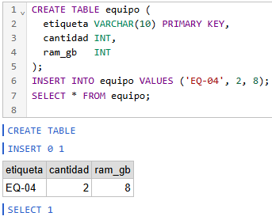
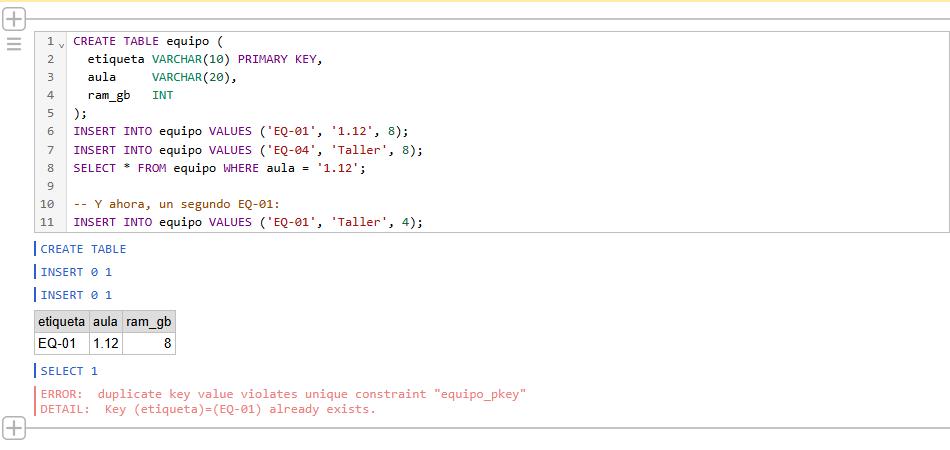

# Ficha del gestor: PostgreSQL

Equipo: Castores · Integrantes: Bruno, Javier, Iván y Marcos.

## 1. Qué es

| # | Campo | Respuesta | Fuente (URL) |
|---|---|---|---|
| 1 | Quién lo desarrolla y desde cuándo. ¿Nació de otro producto? | Lo desarrolla la comunidad de código abierto PostgreSQL Global Develpmoent Group desde 1996. Primero, el proyecto POSTGRES (1986), que nació como sucesor del sistema INGRES. Posteriormente, unos estudiantes Andrew Yu y Jolly Chen agregaron unn intérprete  de lenguaje SQL, creando Postgre95. Finalmente, en 1996 llega el actual PostgreSQL con total compatbilidad a SQL. | https://www.todopostgresql.com/preguntas-y-respuestas-sobre-postgresql/ |
| 2 | Licencia: libre o de pago. Cuál exactamente. ¿Hay versión gratuita? ¿Ha cambiado de licencia? (apartado 6) | PostgreSQL es gratuito y de código abierto. Su licencia es PostgreSQL License similar a las MIT/BSD.  | https://www.postgresql.org/about/licence/ |
| 3 | Dos empresas u organizaciones conocidas que lo usan | Apple, Spotify, Instagram, o Nebulas X. | https://nubecolectiva.com/blog/5-empresas-o-proyectos-que-usan-postgresql/ |

## 2. Cómo guarda los datos

| # | Campo | Respuesta | Fuente (URL) |
|---|---|---|---|
| 4 | Modelo de datos: relacional (tablas), documental, clave-valor, columnar, de grafos… (apartado 4) |  Utiliza principalmente un modelo de datos relacional y objeto-relacional, lo que significa que organiza la información en tablas conectadas entre sí, pero además permite manejar características avanzadas de orientación a objetos (como herencia de tablas y tipos personalizados) y soporta datos semiestructurados (como JSON). | https://www.databricks.com/es/blog/what-is-postgresql-database |
| 5 | Cómo quedaría el equipo EQ-04, con sus dos módulos de RAM, guardado en este gestor. Un dibujo o un ejemplo |  | https://www.aprendesql.dev/filtrando-datos |
| 6 | ¿Hay que definir la estructura antes de guardar datos (esquema fijo) o no? | Sí, al ser un sistema relacional requiere esquema fijo previa definición mediante comandos SQL | https://www.postgresql.org/docs/current/ddl-basics.html |

## 3. Dónde vive

| # | Campo | Respuesta | Fuente (URL) |
|---|---|---|---|
| 7 | Dentro de la aplicación (embebido), en un servidor al que se conectan los clientes, o como servicio en la nube (apartado 5.1) | Se define como modelo cliente-servidor. Técnicamente, se divide en un proceso de servidor (administra los archivos de la base de datos) y en la aplicación cliente (como una aplicación gráfica). |https://www.postgresql.org/docs/current/tutorial-arch.html||
| 8 | ¿Puede repartir o copiar los datos entre varias máquinas? ¿Cómo se llama eso en este gestor? (apartado 5.2) | Sí. Cuando necesitas que toda la base de datos se copie exactamente igual en otros servidores, el concepto técnico se llama *replicación*. . Si el objetivo es romper una base de datos masiva en múltiples servidores porque ya no cabe en uno, tu término es *fragmentación*.| https://cloud.google.com/discover/what-is-database-sharding?hl=es |
| 9 | Sistemas operativos en los que funciona | Funciona en Linux, Windows, macOS, UNIX y BSD. Actualmente, lo más común es la instalación en contenedores tales como Docker o Kubernetes.| https://cloud.google.com/learn/postgresql-vs-sql?hl=es |

## 4. Qué ofrece como gestor

| # | Campo | Respuesta | Fuente (URL) |
|---|---|---|---|
| 10 | Lenguaje: ¿SQL u otro? Un ejemplo de cómo se pide «el equipo EQ-04» (apartado 3.3) | ``` SELECT * FROM equipos WHERE id = EQ-04 ``` | https://learnsql.es/blog/20-ejemplos-de-consultas-sql-basicas-para-principiantes-una-vision-completa/ |
| 11 | ¿Tiene transacciones? ¿Cumple ACID del todo, en parte o no? (apartado 3.2) | Sí, PostgreSQL tiene transacciones y cumple las reglas ACID (Atomicidad, Consistencia, Aislamiento y Durabilidad) del todo. Gestiona las transacciones mediante MVCC (Multiversion Concurrency Control); un método que usan las bases de datos para permitir que varios usuarios lean y escriban datos al mismo tiempo sin bloquearse entre sí. |https://xomalli.blogspot.com/2013/03/entendiendo-transacciones-con-postgresql.html https://www.geeksforgeeks.org/postgresql/multiversion-concurrency-control-mvcc-in-postgresql/ |
| 12 | ¿Tiene usuarios y permisos propios? (apartado 3.4) | Sí, se pueden crear usuarios y roles con permisos granulares (leer, modificar, etc). Cada usuario o rol tiene asignados unos permisos especficios para cada objeto de la bases de datos. | https://www.postgresql.org/docs/current/user-manag.html https://aws.amazon.com/es/blogs/aws-spanish/managing-postgresql-users-and-roles/ |
| 13 | Una herramienta gráfica para administrarlo o consultarlo | pgAdmin, disponible para Windows, Linux y macOS y en contenedores. | https://openwebinars.net/blog/pgadmin-para-novatos-como-gestionar-bases-de-datos-sin-complicaciones/ |

## 5. Valoración

| # | Campo | Respuesta |
|---|---|---|
| 14 | Para qué destaca | Se destaca la tolerancia a fallos, su alto rendimiento que almacena los datos de forma estructurada, así como su facilidad de monitorización proporcioandado estadísticas sobre la actividad del servidor |
| 15 | Una limitación importante | Existen varias limitaciones. Una limitación técnica sería un tamaño de campo de 1 GB u otra: 65.535 para los parámetros de consulta. A nivel operativo se encuentra el peor rendimiento en bases pequeñas o la gestión de conexiones concurrentes que puedes generar una saturación en la CPU y RAM.  |
| 16 | Clasificación: por modelo, por ubicación y por licencia (apartado 6) | Modelo: objeto relacional. Ubicación: cliente-servidor de forma nativa. Licencia: Libre bajo su propia licencua.|
| 17 | ¿Serviría para el inventario del aula? ¿Por qué sí o por qué no? | Sí, técnicamente es posible. Cuenta con la integridad de datos (ACID) y concurrencia que permite a varias personas consultar o actualizar el inventario al mismo tiempo. El único probema es su excesiva complejidad para administradores o personal inexperto.|

## 6. La prueba

Qué hicimos, qué salió y qué nos llamó la atención (tres o cuatro líneas). Captura en `E2-prueba.png`.

### ¿Qué hicimos? ¿Qué salió? ¿Qué devuelve el SELECT? ¿Qué pasa con el último INSERT, y por qué? ¿Qué regla de la teoría es esa?
Copiar y pegar el código en la web de [dbfiddle.uk](https://dbfiddle.uk/A-WS1zJr) que corresponde a SQL.

En el código creamos la tabla `equipo`.

```sql
CREATE TABLE equipo
```

En la tabla `equipo` creamos las columnas `etiqueta`, `aula` y `ram`. Las columnas `etiqueta` y `aula` van a cadenas de carácteres con una limitación de 10 y 20 carácteres respectivamente. Mientras, que `ram_gb` va a contener números enteros. Además, la columna `aula` es clave primera (`PRIMARY KEY`), es decir, es el identificador único para cada fila, para cada `equipo` en este ejemplo.

```sql
etiqueta VARCHAR(10) PRIMARY KEY,
aula     VARCHAR(20),
ram_gb   INT
```

Posteriormente, añadimos dos filas una que corresponde al equipo con identificador `EQ-01` y la siguiente al `EQ-04`. En el primer caso, `1.12` es el aula y `8` es los gigas de RAM.

```sql
INSERT INTO equipo VALUES ('EQ-01', '1.12', 8);
INSERT INTO equipo VALUES ('EQ-04', 'Taller', 8);
```

La siguiente línea nos sirve para buscar y mostrar información que ya está guardada (`select`). Busca todas las columnas (`*`) en la tabla (`equipo`) donde exista el valor sea `1.12` en la columna `aula`.

```sql
SELECT * FROM equipo WHERE aula = '1.12';
```

Por último, escribimos una línea errónea. Lo que hace es insertar en la tabla `equipo` unos valores. Da error porque intenta añadir otros datos con el mismo identificador (`EQ-01`) que ya se encuentra guardado en la tabla. Este identificador no se puede repetir y da error su creación.
```sql
INSERT INTO equipo VALUES ('EQ-01', 'Taller', 4);
```
La regla de la teoría que se incumple es:
> ### 1.6 Atributos identificadores y claves
>
> Atributo identificador: su valor es único y no se repite entre instancias.


