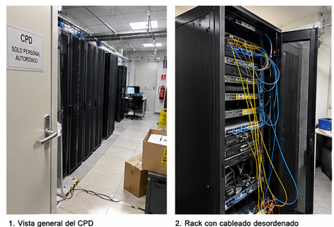
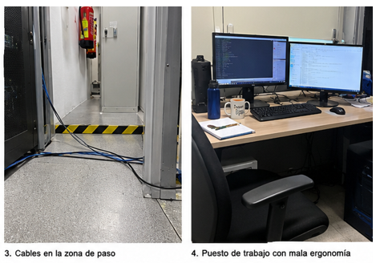
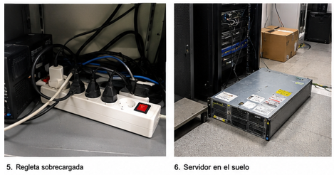
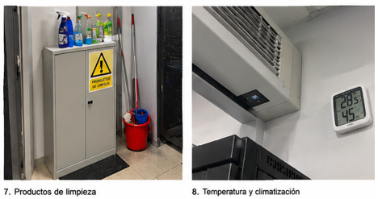
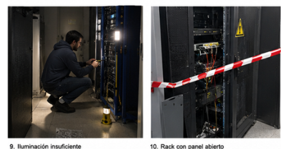
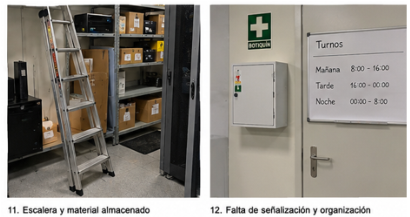

# Reto 1: El CPD no es un lugar seguro
Fecha de entrega: 6 de octubre de 2026

Nombre de los integrantes del grupo: Buno, Javier, Iván y Marcos.
#### 1. Resultados de aprendizaje: RA 2
En este Reto 1 se evalúa el **RA 2:  Adquiere las competencias necesarias para el desempeño de las funciones de nivel básico en Prevención de Riesgos Laborales**.
#### 2. Vuestra misión
Acabáis de incorporaros como técnicos/as de sistemas a NetSys, una empresa que está ampliando su infraestructura informática.

La empresa dispone de un pequeño Centro de Procesamiento de Datos (CPD) donde se encuentran servidores, equipos de comunicaciones, sistemas de alimentación eléctrica y sistemas de refrigeración.

Antes de ponerlo definitivamente en funcionamiento, la dirección os plantea una pregunta:
#### 3. Organización
* **Responsable de riesgos** (Marcos Sánchez Gracia): Identifica los peligros y realiza la evaluación inicial.
* **Responsable de ergonomía** (Javier Martínez Gavin): Analiza puestos de trabajo, pantallas, posturas y organización del trabajo.
* **Responsable de emergencias** (Bruno Coscojuela Viader): Diseña las actuaciones ante incendio, evacuación, accidente, etc.
* **Responsable de prevención** (Iván Gimeno Montoya): Investiga derechos, obligaciones y medidas preventivas.
## Fase 1: Inspección

### En esta fase observamos las imágenes y cada responsable del equipo aporta un análisis desde su función en la PRL.
#### Primera imagen
**Responsable de riesgos**: Hay cajas y cables de por medio con riesgo de caerse
por los obstáculos.

**Responsable de ergonomía**: Instalación de escaleras o elevador, instalación de armarios para organizar el inventario del suelo.

**Responsable de emergencias**: Instalación de un botón de emergencias por si hay algún accidente.

**Responsable de prevención**: Derecho de poder trabajar en un espacio sin riesgos para la integridad física y mental del personal.

#### Segunda imagen:

**Responsable de riesgos**: Peligro de electrocutarse o cortocircuito, riesgo
eléctrico, tropezarse y peligro de engancharse.

**Responsable de ergonomía**: Utilización prendas no holgadas, cerrar la puerta y
ordenar los cables.

Responsable de emergencias: Equipo de emergencia, sistema que pare la
corriente en caso de electrocutamiento.

Responsable de prevención: Derecho de poder trabajar en un espacio sin riesgos
para la integridad física y mental del personal.

#### Tercera imagen:

Responsable de riesgos: Caerse y golpearse con el extintor

Responsable de ergonomía: Organización de cables y señalización de obstáculos
y adaptaciones para personas que no puedan subir el escalón

Responsable de emergencias: Instalación de accesos ante emergencias, alarma
antiincendios.

Responsable de prevención: Extintores sin caducar, cartel avisador y obligación
poder acceder a las zonas de paso para personas con movilidad reducida

Cuarta imagen:

Responsable de riesgos: Riesgo lesion lumbar, hernias, problemas oculares,
síndrome del túnel carpiano.

Responsable de ergonomía: Instalación de sillas ergonómica, gafas de luz azul,
ratón ergonómico, escritorio elevable, monitor que disminuya fatiga visual

Responsable de emergencias: Que la fuente de alimentación tenga protección
antiincendios, certificación de espacio libre de humos,
Responsable de prevención: Seguro medico
Quinta imagen:
Responsable de riesgos: Peligro de incendio y explosion y riesgo de pérdida de
datos debido a que se apaguen los pcs
Responsable de ergonomía: Comprar varias alargaderas y regletas
Responsable de emergencias: Comprar un protector de enchufe contra
sobretensiones
Responsable de prevención: Por ley tienes la obligación de no sobrecargar los
enchufes.
Sexta imagen:
Responsable de riesgos: Explosion del servidor y alrededores debido a impactos
infligidos por los trabajadores
Responsable de ergonomía:Colocación del servidor en un armario con
protección y refrigeración
Responsable de emergencias: Instalar un extintor y comprar un botiquín de
primeros auxilios
7
Responsable de prevención: Derecho a un espacio de trabajo común que esté
ordenado
Séptima Imagen:
Responsable de riesgos: Peligro de intoxicación por productos químicos debido
al derrame de productos de limpieza, junto a los riesgos eléctricos asociados a
un cuadro eléctrico
Responsable de ergonomía: Separar los productos de limpieza de los eléctricos.
Responsable de emergencias: Instalar un botón rojo que sirva para cortar la
corriente eléctrica general si se derrama líquido sobre el cuadro eléctrico.
Responsable de prevención: No es legal instalar un cuadro eléctrico en el mismo
espacio que el material de limpieza
Octava imagen:
Responsable de riesgos: Peligro de temperatura y humedad no adecuados
Responsable de ergonomía: Comprar un termostato para que se mantenga
siempre en una temperatura y humedad adecuados.
Responsable de emergencias: Que hayan ventanas y conductos de ventilación
por si hay un corte de electricidad
Responsable de prevención: Derecho para que la temperatura esté entre 17-27
grados celsius
8
Novena imagen:
Responsable de riesgos: Daño ocular y peligro ante caídas debido a la poca
iluminación
Responsable de ergonomía: Instalar luces led que estén colocadas de forma que
no dejen ningún recoveco sin luz
Responsable de emergencias: Luz de emergencia ante posibles apagones
Responsable de prevención: La ley prohíbe trabajar con poca luz.
Decima imagen:
Responsable de riesgos: Peligro de electrocutarse, engancharse con los cables,
pueden entrar animales.
Responsable de ergonomía: Reordenar el interior del armario para poder cerrar
la puerta correctamente.
Responsable de emergencias: Extintor anti incendios, acceso a salida de
emergencia.
Responsable de prevención: Obligación de realizar una limpieza periódica y una
correcta distribución del espacio de trabajo
Undecima imagen:
Responsable de riesgos: Caídas por organizar el material subido a la escalera.
Responsable de ergonomía: Que no sea necesario el uso de la escalera para
organizar el material de trabajo.
Responsable de emergencias: La disponibilidad de un teléfono de emergencia
Responsable de prevención: Uso de casco siempre que se use la escalera o exista
la posibilidad de que pueda caerse material del armario
Duodécima imagen:
Responsable de riesgos: Peligro de accidentes a causa de una mala señalización
y además perder el tiempo por mala organización.
Responsable de ergonomía: Colocar en el espacio de trabajo los horarios de
trabajo y que realizar en las siguientes horas.
Responsable de emergencias: Canal de mensajes por si hay dudas acerca de la
organización de trabajo o del significado de la señalización.
Responsable de prevención: Obligación de colocar señalización en situaciones o
lugares de riesgo.