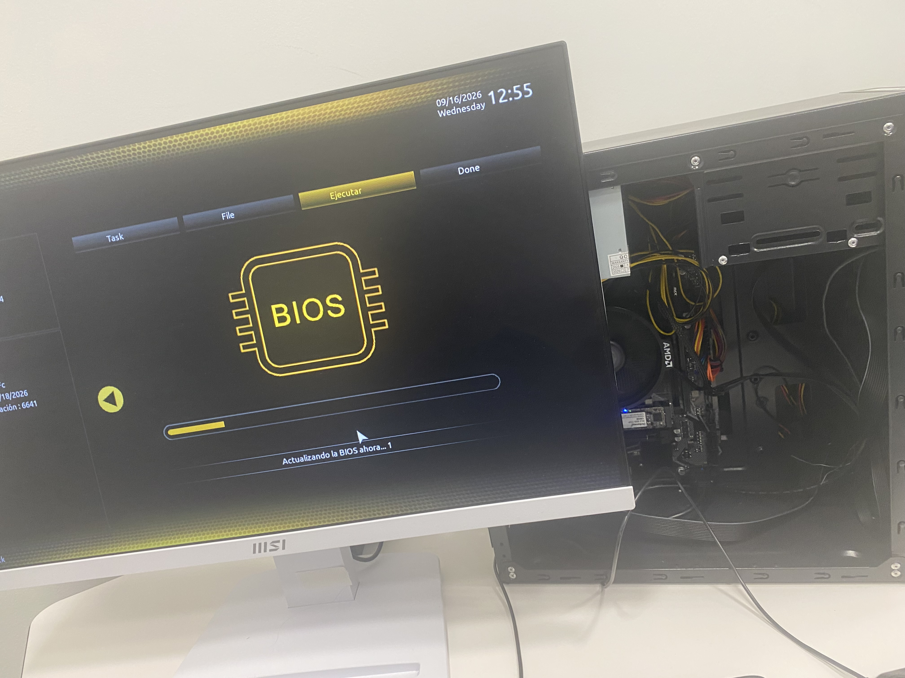
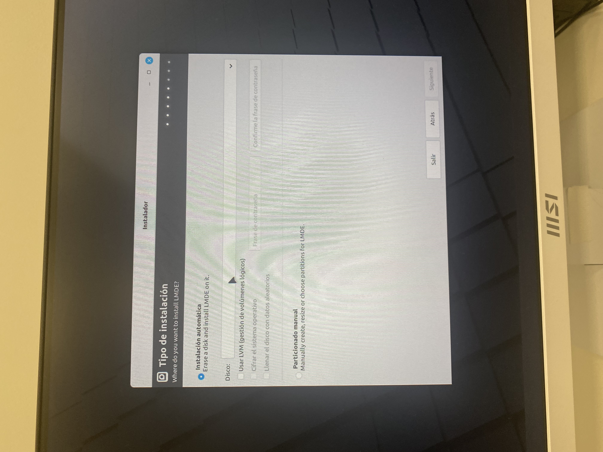
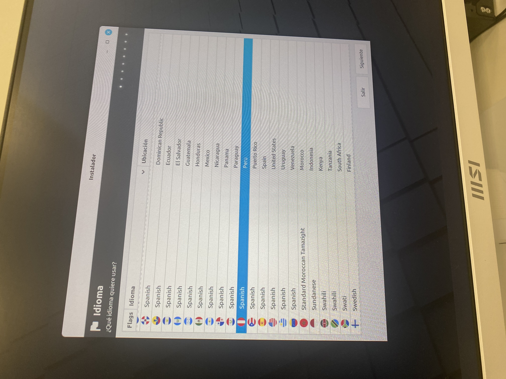
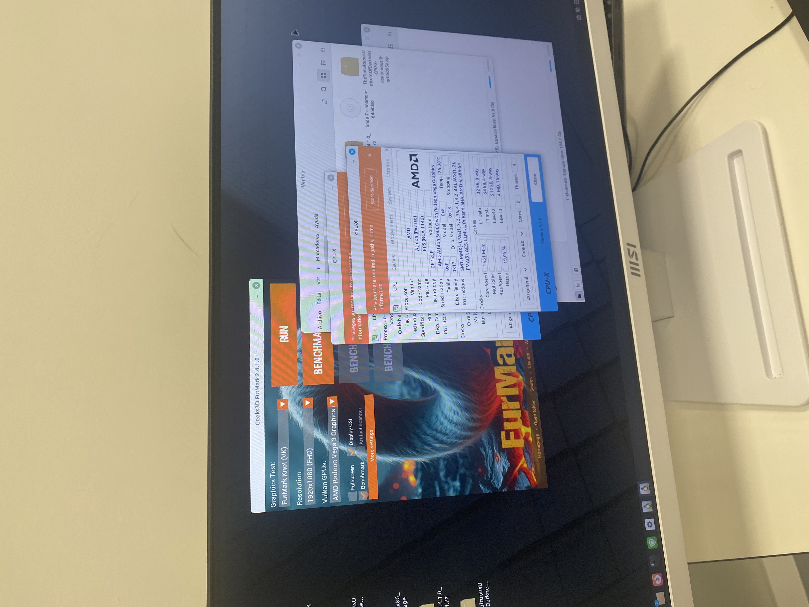
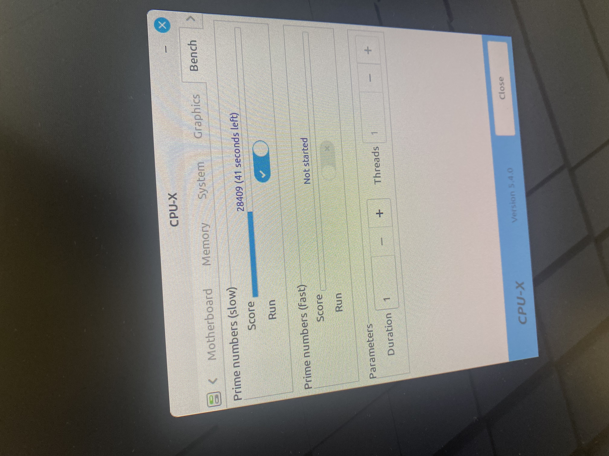
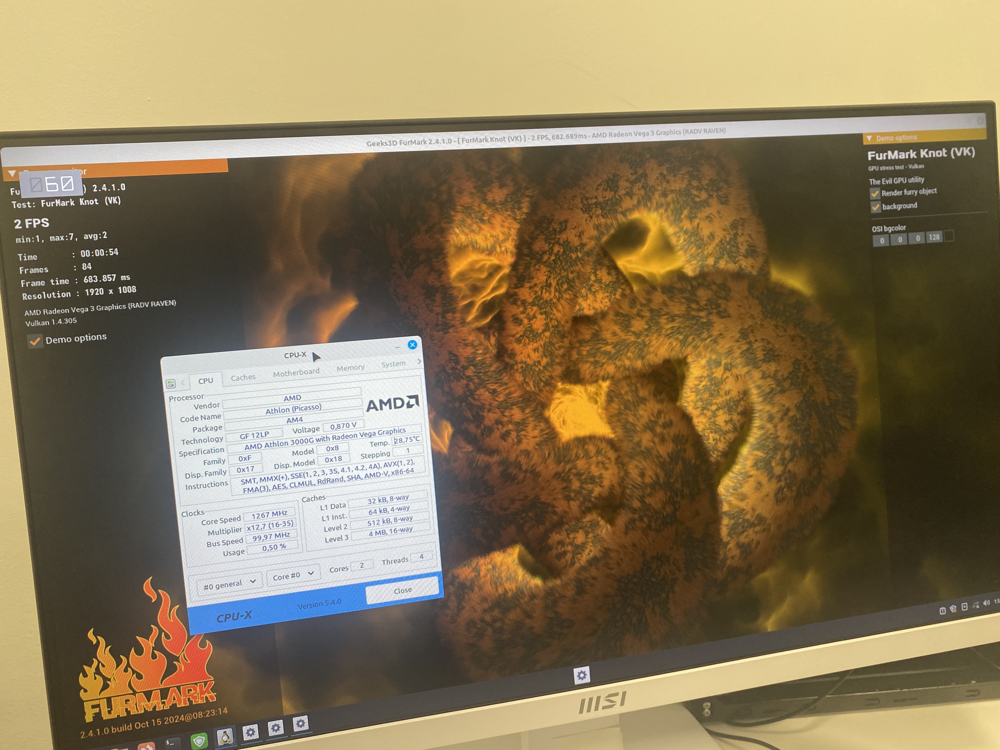
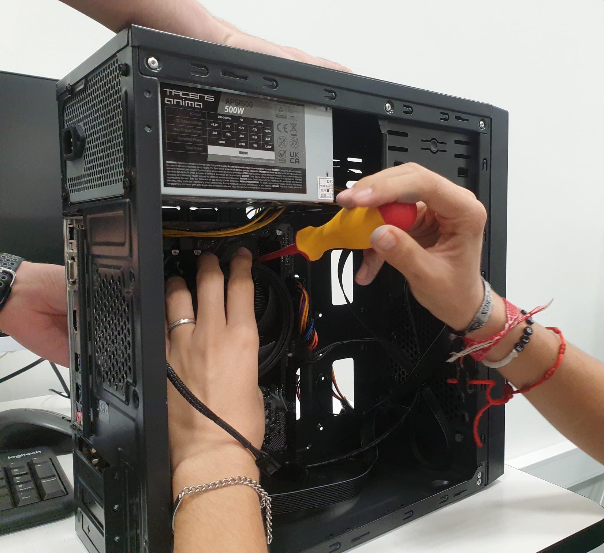
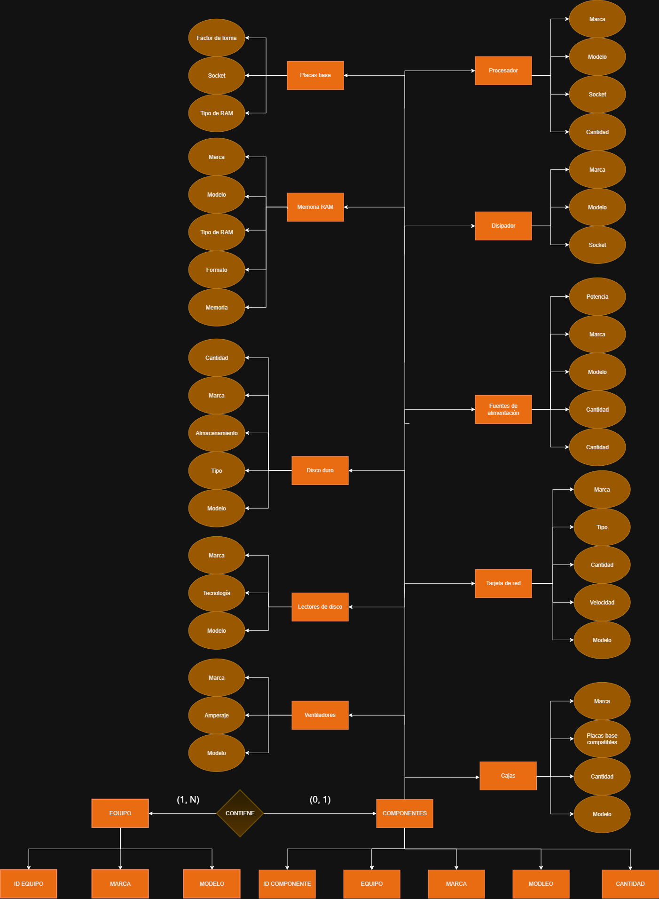

# Grupo Castores S.L.
- [1. Introducción](#1-introducción)
    - [1.1. Descripción del proyecto](#11-descripción-del-proyecto)
    - [1.2. Objetivos del proyecto](#12-objetivos-del-proyecto)
- [2. Análisis del contexto y justificación de la propuesta](#2-análisis-del-contexto-y-justificación-de-la-propuesta)
- [3. Estado del arte](#3-estado-del-arte)
- [4. Requisitos del proyecto](#4-requisitos-del-proyecto)
    - [4.1. Requisitos funcionales](#41-requisitos-funcionales)
    - [4.2. Requisitos no funcionales](#42-requisitos-no-funcionales)
- [5. Planificación](#5-planificación)
    - [5.1. Fases del proyecto](#51-fases-del-proyecto)
    - [5.2. Cronograma de trabajo](#52-cronograma-de-trabajo)
    - [5.3. Recursos necesarios](#53-recursos-necesarios)
- [6. Desarrollo del proyecto](#6-desarrollo-del-proyecto)
    - [6.1. Análisis y diseño](#61-análisis-y-diseño)
    - [6.2. Tecnologías/Herramientas empleadas](#62-tecnologíasherramientas-empleadas)
    - [6.3. Partes contratantes](#63-partes-contratantes)
    - [6.4. Presupuesto](#64-presupuesto)
    - [6.5. OPCIONAL: Contrato y pliego de condiciones](#65-opcional-contrato-y-pliego-de-condiciones)
    - [6.6. OPCIONAL: Análisis de riesgos](#66-opcional-análisis-de-riesgos)
- [7. Pruebas y validación](#7-pruebas-y-validación)
- [8. Documentación técnica](#8-documentación-técnica)
- [9. Conclusiones](#9-conclusiones)
    - [9.1. Desviación sobre la planificación inicial](#91-desviación-sobre-la-planificación-inicial)
    - [9.2. Resultados obtenidos y posibles mejoras futuras](#92-resultados-obtenidos-y-posibles-mejoras-futuras)
    - [9.3. Valoración personal](#93-valoración-personal)
    - [9.4. OPCIONAL: Agradecimientos](#94-opcional-agradecimientos)
- [10. Bibliografía](#10-bibliografía)
- [11. Anexos](#11-anexos)
## 1. Introducción 
### 1.1. Descripción del proyecto
Este proyecto corresponde al Reto 0 de 1º de ASIR: Recuperación y digitalización del parque informático. El centro dispone de ordenadores, periféricos y componentes de distintas generaciones, algunos funcionales, otros averiados o incompletos, y no existe un registro fiable de qué hay, en qué estado está ni qué se ha hecho sobre cada equipo.

Nuestro equipo Castores formado por (Marcos, Iván, Javier y Bruno) debe estudiar el material, recuperar al menos un equipo plenamente funcional, documentar todo el proceso y crear un inventario digital basado en una base de datos propia. Además, debemos proponer cómo gestionar el parque informático de forma más eficiente mediante tecnologías digitales.
### 1.2. Objetivos del proyecto
El presente proyecto persigue como principal objetivo la puesta en valor del material informático disponible, con el fin de ensamblar un equipo plenamente funcional, al mismo tiempo que se lleva a cabo un proceso exhaustivo de organización e inventariado.

Para alcanzar esta meta, el desarrollo se estructurará en diversas fases interconectadas. En primer lugar, se procederá a la identificación, catalogación y evaluación técnica de todos los recursos físicos existentes, abarcando equipos, componentes y periféricos. Este análisis minucioso permitirá determinar con precisión qué elementos son susceptibles de ser recuperados, reutilizados o reparados, y cuáles, por el contrario, deberán ser descartados de manera definitiva.

Una vez clasificado el material, la labor técnica se centrará en el montaje o la reparación de, como mínimo, un sistema informático operativo. Dicha intervención requerirá una justificación técnica rigurosa que acredite la compatibilidad de los componentes seleccionados. Posteriormente, se abordará la dotación de software mediante la elección, instalación y configuración del sistema operativo más adecuado para el hardware ensamblado, argumentando sólidamente esta decisión frente a otras alternativas disponibles.

De manera transversal a estas tareas, la gestión de los recursos quedará respaldada por el diseño y la implementación de una base de datos para el control del inventario, la cual se alimentará con datos reales y estará optimizada para la ejecución de consultas de valor práctico. Asimismo, el rigor documental del proyecto se asegurará mediante el registro continuo de todas las intervenciones y la conservación de evidencias del progreso a través de la metodología Kanban.

Finalmente, la ejecución de todas estas actividades se sustentará en un modelo de trabajo en equipo estrictamente organizado, cuyo propósito pedagógico y colaborativo es garantizar que cada uno de los integrantes adquiera un dominio integral sobre la totalidad de las competencias y áreas abordadas durante el reto.

## 2. Análisis del contexto y justificación de la propuesta 
**¿Cuál es el problema?**. El centro cuenta con material informático con mucha diferencia de antigüedad. Por lo que nos resulta difícil saber qué material hay, en qué estado está, qué características tiene, qué componentes son compatibles entre sí y qué equipos son recuperables.

No se trata solo de un problema técnico como reparar ordenadores, sino de gestión de la información: sin un registro fiable se duplican esfuerzos, se pierde material aprovechable y no se pueden tomar las decisiones correctas.

Debemos buscar una solución que combine (1) la recuperación práctica de un equipo, (2) un inventario en base de datos y (3) una propuesta de digitalización:

Aprovecha recursos ya existentes, reduciendo costes y residuos electrónicos que contaminarían el ecosistema.
Deja una marca de cada equipo, componente e intervención.
Permite a la persona responsable responder preguntas como qué equipos se pueden usar, qué material está disponible o qué equipos tienen incidencias pendientes o se tienen que llevar para reciclarlos al punto limpio o similares.
Es mantenible en el tiempo, porque la información queda estructurada y no depende de la memoria de nadie y hace mas fácil cuando haya que actualizarlo con nuevos componentes.

## 3. Estado del arte 
### 1. Gestión de Activos Informáticos (ITAM) y CMDB
La **gestión de activos de Tecnologías de la Información** (**ITAM**, *IT Asset Management*) y las bases de datos de gestión de la configuración (**CMDB**, *Configuration Management Database*) constituyen la base operativa para supervisar, controlar e inventariar la infraestructura tecnológica de una organización. Mientras que la CMDB centra su atención en las relaciones, dependencias y servicios que prestan los elementos de configuración (*Configuration Items* o CIs), el enfoque ITAM abarca el control financiero, contractual y físico del hardware y software a lo largo de todo su ciclo de vida.

El ciclo de vida del hardware dentro del almacén se divide en cinco etapas clave:

1. **Planificación y Adquisición**: Registro de la necesidad, orden de compra y proveedor.

2. **Recepción e Inventariado**: Asignación de identificadores únicos (números de serie, códigos de barras o etiquetas QR) y registro inicial en stock.

3. **Despliegue y Asignación**: Cambio de estado a "En uso", vinculando el equipo a un usuario, departamento o ubicación física.

4. **Mantenimiento, Diagnóstico y Reacondicionamiento**: Período operativo donde el activo sufre reparaciones, sustitución de componentes (upgrades) o formateo para un nuevo ciclo de uso.

5. **Baja y Desincorporación**: Proceso final impulsado por obsolescencia o avería irreparable, exigiendo el desguace por componentes reutilizables, borrado seguro de información y la gestión del residuo.

La trazabilidad granular a nivel de componente resulta fundamental en la gestión de almacén. No basta con registrar el equipo completo (p. ej., un ordenador de sobremesa); es necesario auditar la composición interna (módulos de RAM, discos duros, procesadores, fuentes de alimentación y tarjetas de expansión) para permitir el intercambio de piezas entre sistemas en desuso (cannibalization) y garantizar la máxima disponibilidad de recambios.

### 2. Análisis Comparativo de Herramientas de Código Abierto para ITAM/CMDB
El ecosistema open source ofrece diversas soluciones para la gestión de activos, cada una orientada a un perfil operativo específico (Helpdesk integral, inventario puro de almacén o gestión de infraestructura de red/data center).

* **GLPI**: Entornos corporativos que requieren gestión integral de inventario, contratos, licencias y mesa de ayuda.
* **Snipe-IT**: Control estricto de entradas, salidas, asignación de componentes, consumibles y licencias a usuarios.
* **OCS Inventory**: Auditoría rápida y automatizada del hardware y software instalado en redes heterogéneas.
* **Netbox**: Gestión de racks, cableado, direcciones IP y equipamiento de red en centros de datos.

### 3. Reutilización, Diagnóstico y Reacondicionamiento de Hardware
El reacondicionamiento de equipos (*refurbishing*) requiere comprobar rigurosamente los parámetros de compatibilidad física y electrónica entre componentes, así como ejecutar protocolos de testeo previo a la incorporación al inventario activo.

#### Criterios Técnicos de Compatibilidad
* **Procesador** (CPU): Compatibilidad del socket físico (p. ej., LGA1200, LGA1700, AM4, AM5) y soporte específico del chipset de la placa base (verificado vía tabla de compatibilidad BIOS/UEFI).

* **Memoria RAM**: Tipo de tecnología (DDR3, DDR4, DDR5), formato (DIMM para torre, SO-DIMM para portátiles/mini PCs), frecuencia máxima soportada por la controladora de memoria, latencias (CL) y soporte para memoria con/sin corrección de errores (ECC vs non-ECC).

* **Fuente de Alimentación** (PSU): Formato mecánico (ATX, SFX, TFX), potencia nominal continuada, distribución y amperaje del raíl de +12V, y conectores disponibles (ATX 24-pin, EPS 12V 4+4 pin, PCIe 6+2 pin, conectores SATA/Molex).

* **Interfaces de Almacenamiento**: Mosaico de conectores SATA III (6 Gbps), M.2 (diferenciando conectores Key B, Key M, y protocolos SATA vs NVMe PCIe Gen3/Gen4/Gen5) y bus de expansión PCIe (factor de forma y revisión del bus).

* **Firmware** (BIOS / UEFI): Identificación del modo de arranque (Legacy BIOS frente a UEFI nativo), compatibilidad con esquemas de partición MBR o GPT, y soporte para tablas de claves de seguridad (Secure Boot).

#### Protocolo de Diagnósitco Operativo
1. **Verificación de Encendido y POST** (*Power-On Self-Test*): Comprobación de la secuencia inicial de comprobación de hardware mediante el análisis de códigos emitidos por altavoz interno (beeps), LEDs de depuración (Debug LEDs) o tarjetas de diagnóstico PCI/PCIe.
2. **Actualizar la BIOS**: El motivo es permitir la actualización para que puede reconoce nuevos componentes, corregir errores y el más importante; reparar fallos de seguridad.

3. **Pruebas de rendimiento y estrés**: Son útiles para determinar que el hardware funciona a plena capacidad. Ejemplos; FurMark para tarjetas gráficas, CPU-Z o CPU-X para el procesador, MemTest86 para la memoria RAM o Victoria para discos duros o SSD.

### 4. Selección de Sistemas Operativos para el hardware restringido

En cuanto a la elección de sistemas operativos se suele recomendar siempre lo mismo: para la productividad general, Linux para servidores y desarrollo, y macOS para diseño y creatividad.

En la práctica:
* Microsoft Windows: En sus versiones empresariales (LTSC o Server) son una opción estable y destaca su compatibilidad total con diversidad de software y facilidad de uso.
* Linux: Districuiones como Debian o Fedora se posicionan como la opción prefereida para entornos técnicos, servidores y computación en la nube. Destaca por su mayor seguridad, aunque requiere de mayores conocimiento técnicos para su administración.
* macOS (Apple): Tiene sentido en emprersas enfocadas en el diseño gráfico, desarrollo multimedia y la producción creativa.

### 5. Motores de bases de datos
Para almacenar los componentes del inventario de forma rápida, segura y estructurada tenemos que usar un buen motor de base de datos. A continuación, se describen brevemente algunos de los más utilizados.

* **SQLite**: Motor de base de datos embebido en fichero local, sin necesidad de proceso servidor. Excelente para aplicaciones de escritorio locales, prototipos o terminales independientes de inventario con lecturas/escrituras de bajo volumen.

* **MySQL** / **MariaDB**: Estándar en aplicaciones web de gestión (backend nativo de GLPI y Snipe-IT). Ofrece alto rendimiento en lecturas, amplia compatibilidad y sencillez de administración mediante replicación maestro-esclavo.

* **PostgreSQL**: SGBD relacional de nivel empresarial con soporte avanzado para consultas complejas, tipos de datos JSON/JSONB (ideal para guardar especificaciones técnicas heterogéneas de componentes) e integridad transaccional estricta (ACID).

### 6. Herramientes de organizaciñon y metodología del proyecto

Con motivo de realizar el trabajo de forma más orgsanizado, estructurada y con menos errores se utilizan herramientas de organización.

* **Planka**: Solución open source autoalojada (self-hosted), ligera y enfocada exclusivamente en tableros Kanban. Perfecta para mantener la privacidad de los datos de infraestructura interna sin depender de servicios SaaS externos.

* **GitHub Projects**: Integración nativa si el código fuente o las tareas del inventario se gestionan en un repositorio Git. Permite automatizar el cierre de tareas (issues) cuando se realizan cambios en el código o despliegues.

* **Trello**: Plataforma SaaS de interfaz intuitiva y rápida curva de aprendizaje, aunque limitada en sus planes gratuitos para integraciones complejas o cumplimiento estricto de privacidad de datos local.

* **Notion**: Herramienta híbrida que combina bases de datos relacionales simples, documentos y tableros Kanban. Adecuada para documentar guías de montaje y diagnósticos junto con el tablero de seguimiento, aunque con mayor sobrecarga operativa.

### 7. Sostenibilidad, Normativa RAEE y Borrado Seguro de Datos
Gestionar el hardware que llega al final de su ciclo de vida no es simplemente decidir qué se guarda y qué se tira; es encontrar un equilibrio real entre el compromiso ecológico y la protección rigurosa de la información confidencial.

#### Economía Circular vs. Basura Electrónica (RAEE)
Extender la vida útil de los equipos es siempre la opción más limpia y eficiente. Reparar o reutilizar componentes minimiza el volumen de desperdicio y reduce de forma directa la huella de carbono al posponer la fabricación de hardware nuevo. Sin embargo, cuando la degradación o las averías hacen imposible recuperar un componente, la reutilización cede el paso al reciclaje responsable:

* **Cumplimiento de la normativa RAEE**: Se activa el marco legal para Residuos de Aparatos Eléctricos y Electrónicos (la Directiva 2012/19/UE a nivel europeo y el Real Decreto 110/2015 en España).

* **Gestión autorizada**: El material inservible no puede desecharse en contenedores convencionales. Se tramita mediante gestores homologados que certifican la recogida, aseguran la extracción limpia de metales pesados o contaminantes y canalizan las materias primas para su reincorporación al ciclo industrial.

#### Borrado Seguro de Datos y Cumplimiento del RGPD
Reutilizar o deshacerse de un disco sin una limpieza profunda representa un riesgo de seguridad inaceptable. El Reglamento General de Protección de Datos (RGPD) obliga a garantizar que la información personal, comercial o sensible sea completamente irrecuperable antes de que el soporte cambie de manos o pase al reciclaje.

Un error muy extendido es asumir que un formateo habitual (FAT32, NTFS, EXT4) o la eliminación de una partición dejan el disco "limpio". En realidad, el formateo tradicional solo elimina el "índice" que le dice al sistema dónde están los archivos; la información sigue intacta en la memoria y cualquiera con un software básico de recuperación de datos puede restaurarla en cuestión de minutos.

#### Métodos de Higienización Según la Tecnología
Para que la destrucción de la información sea irreversible, el método de borrado debe adaptarse a la tecnología del soporte:

* **Discos Mecánicos (HDD)**: La técnica clave es la sobrescritura completa. Guiados por estándares internacionales como NIST SP 800-88 o DoD 5220.22-M, se escriben ceros, unos y datos aleatorios sobre cada sector magnético. En la práctica, herramientas libres como shred, dd o soluciones estilo DBAN (Darik's Boot and Nuke) ejecutan esta tarea con total fiabilidad.

* **Unidades de Estado Sólido (SSD)**: La sobrescritura repetida genera un desgaste innecesario en las celdas Flash y no suele alcanzar las zonas ocultas de gestión interna (over-provisioning). En los SSD, la solución pasa por enviar órdenes de bajo nivel al propio controlador de la unidad mediante comandos como ATA Secure Erase o NVMe Sanitize / Format (usando utilidades como nvme-cli), restableciendo las celdas a su estado eléctrico original.

* **Destrucción Física**: Si un disco está defectuoso y no responde a los comandos de borrado por software, la única alternativa segura es su inutilización definitiva mediante desmagnetización (degaussing) o trituración mecánica (shredding).
## 4. Requisitos del proyecto
### 4.1. Requisitos funcionales
1. Identificar de forma única cada equipo, componente y periférico (código de inventario/etiqueta).
2. Registrar características técnicas y estado de cada componente. 
3. Registrar qué componentes forman parte de cada equipo y sus cambios (historial de montaje).
4. Registrar incidencias detectadas e intervenciones realizadas (fecha, responsable, descripción, resultado).
5. Registrar los sistemas operativos instalados en cada equipo.
6. Consultar mediante HTML: equipos utilizables, material disponible, equipos con incidencias pendientes, componentes de un equipo concreto, historial de actuaciones, sistemas operativos instalados, equipos mejorables y material reutilizable.
7. Obtener al menos un equipo plenamente funcional con SO instalado y configurado.
8. Evitar inconsistencias y duplicidades en los datos (claves, restricciones, normalización).
9. Trabajar con datos reales del material analizado.
### 4.2. Requisitos no funcionales 
1. Usabilidad: el inventario debe poder ser consultado por una persona responsable sin conocimientos avanzados.
2. Integridad y coherencia: uso de claves primarias/foráneas y restricciones.
3. Mantenibilidad y escalabilidad: poder añadir nuevo material sin rediseñar la base de datos.
4. Trazabilidad: todo cambio de componentes o configuración queda registrado.
5. Seguridad y protección de datos: no borrar almacenamiento sin autorización; avisar al profesorado ante datos personales; copias de seguridad de la base de datos.
6. Seguridad física y laboral: no manipular equipos conectados a la corriente y usar protección antiestática.
7. Documentación: todas las decisiones justificadas técnicamente y las fuentes citadas.
8. Realismo y economía: priorizar la reutilización y software libre, sin sobrecargar de tecnologías.
9. Organización: puesto y material ordenados al terminar cada sesión.
1. Usabilidad: el inventario debe poder ser consultado por una persona responsable sin conocimientos avanzados.
2. Integridad y coherencia: uso de claves primarias/foráneas y restricciones.
3. Mantenibilidad y escalabilidad: poder añadir nuevo material sin rediseñar la base de datos.
4. Trazabilidad: todo cambio de componentes o configuración queda registrado.
5. Seguridad y protección de datos: no borrar almacenamiento sin autorización; avisar al profesorado ante datos personales; copias de seguridad de la base de datos.
6. Seguridad física y laboral: no manipular equipos conectados a la corriente y usar protección antiestática.
7. Documentación: todas las decisiones justificadas técnicamente y las fuentes citadas.
8. Realismo y economía: priorizar la reutilización y software libre, sin sobrecargar de tecnologías.
9. Organización: puesto y material ordenados al terminar cada sesión.
## 5. Planificación
### 5.1. Fases del proyecto

---

#### 1. Fase 1: Organización del Equipo y Gestión del Proyecto

En la etapa inicial nos enfocamos en estructurar la metodología de trabajo. **Iván** asignó los roles y redactó el documento organizador para la distribución de tareas, mientras **Bruno** diseñó el logo del equipo.

Para la gestión y el seguimiento continuo, **Iván** configuró el repositorio en GitHub y, junto a **Bruno** y **Javier**, pusimos en marcha un tablero Kanban. En el apartado de inventario, **Marcos**, **Bruno** e **Iván** registraron en Excel el material de la sala R4, tanto ordenadores como componentes guardados en estanterías (fuentes de alimentación, ventiladores, tarjetas gráficas y memorias RAM). 

---

#### 2. Fase 2: Desmontaje, Inspección Física y Hardware

El trabajo práctico comenzó con el desmontaje e identificación de los componentes. Durante esta fase, **Bruno** realizó la limpieza y el mantenimiento de las piezas.

##### Incidencia en el Desmontaje: Procesador pegado al Disipador
**Problema:** Al intentar retirar el disipador de la CPU, el procesador se quedó completamente pegado a la base debido al estado de la pasta térmica.

**Solución:** Se utilizó un secador para aplicar calor de forma directa en el bloque y ablandar la pasta. Una vez caliente la zona, se hizo palanca con cuidado utilizando un destornillador plano hasta lograr desenganchar la CPU sin causar ningún daño a los pines.

Durante el proceso, Javier tomó las fotos de cada componente, Marcos redactó la descripción detallada de cada una e Iván se encargó de renombrar las imágenes. Con el hardware al descubierto, **Bruno** recopiló los *datasheets* y especificaciones oficiales, permitiendo a **Iván** diseñar la matriz de compatibilidad. Una vez documentado el proceso, **Marcos** reensambló el equipo. Posteriormente, **Javier** y **Marcos** repitieron el procedimiento de identificación de componentes en dos ordenadores adicionales de la sala R4.

---

#### 3. Fase 3: Puesta a Punto, Pruebas y Desarrollo Web

##### Configuración del Sistema y Solución de Problemas
Inicialmente, **Iván** preparó un USB ejecutable con Ventoy y Linux Mint. **Javier** actualizó la BIOS a la última versión disponible y activó el perfil XMP en la placa base para exprimir el rendimiento de la memoria RAM.

Debido a problemas de arranque con Linux Mint, decidimos cambiar el sistema a Windows 11. Para preparar el disco duro, booteamos **Hiren's Boot** desde un USB y limpiamos las particiones utilizando la herramienta de consola diskpart. Posteriormente, flasheamos la ISO de Windows 11 e instalamos el sistema correctamente.

Para validar la estabilidad del equipo, **Marcos** y **Javier** ejecutaron pruebas de rendimiento y diagnóstico:
* **OCCT & HWInfo:** Monitorización térmica y comprobación de voltajes en la CPU.
* **CPU-Z / GPU-Z:** Pruebas de rendimiento (*benchmark*) de procesador y tarjeta gráfica.
* **Memtest64:** Test de diagnóstico de estabilidad para la memoria RAM.
* **Unigine Heaven:** Test de estrés para evaluar el rendimiento gráfico.
* **CrystalDiskInfo:** Análisis del estado de salud y errores del disco duro.

##### Desarrollo y Maquetación Web
**Bruno** e **Iván** diseñaron los bocetos iniciales (*mockups*). **Marcos** definió el árbol de la web (*web tree*) para organizar la estructura de las páginas HTML, mientras que **Javier** migró las tablas de Excel e inventario a código HTML y creó las secciones del equipo. El diseño visual se maquetó entre **Bruno**, **Javier** e **Iván** utilizando CSS. Finalmente, el equipo optimizó el código limpiando etiquetas innecesarias, **Marcos** adaptó la matriz de compatibilidad a formato HTML e **Iván** y **Javier** ajustaron la estructura general y el pie de página.

Y por último **Marcos** hizo el formulario de contacto para la recogida de datos sobre incidencias técnicas. Ha configurado los atributos name y value de los campos para estructurar la información de forma clara y ha integrado la API de Web3Forms para recibir las respuestas automáticamente por correo electrónico sin necesidad de servidor propio.

> [!TIP]
> **API**
> Una API (del inglés, application programming interface, en español, interfaz de programación de aplicaciones) es una pieza de código que permite a dos aplicaciones comunicarse entre sí para compartir información y funcionalidades. En el caso de Web3Forms, esta API actúa como un intermediario o "puente" sin servidor (serverless) que conecta los formularios de tu página web (estática o dinámica) directamente con tu correo electrónico.

##### Bases de Datos y Documentación Final
En el apartado de gestión de datos, **Marcos** y **Bruno** desarrollaron el Diagrama Entidad-Relación del proyecto. Por su parte, **Javier** redactó el informe de incidencias y **Bruno** preparó el material para la presentación final.

---

## 4. Resumen Técnico de Intervenciones

* **Material e Instrumental:** Destornilladores (plano y estrella), secador de aire caliente y memorias USB de instalación.
* **Sistemas y Herramientas Utilizadas:** Ventoy, Linux Mint, Windows 11, Hiren's Boot (`diskpart`), OCCT, CPU-Z, GPU-Z, Memtest64, HWInfo, Unigine Heaven y CrystalDiskInfo.
* **Principales Decisiones:** Migración a Windows 11 LTSC tras fallos de arranque en Linux, formateo profundo con `diskpart` y activación del perfil XMP en la BIOS. Posteriormente debido a repentinos apagados pasados 5 minutos encendido, sospechabamos del ssd y decidimos bootear windows desde el usb y ya no daba ningun problema.

### 5.2. Cronograma de trabajo 
Para la organziación diaria del trabajo hemos utilizado dos herramientas clave: un cuaderno de bitácora que asigna las tareas para cada día y para cada compañero, y además, bemos utilizado la plantilla de Kanban en Github Projects donde gestionar el trabajo en tarjetas para las tareas (pendiente, realizado, trabajando, revisando y finalizado.)
[Kanban](https://github.com/users/igimenom/projects/1/views/1)
[Cuaderno de bitácora](./CUADERNO%20DE%20BITACORA.md)
### 5.3. Recursos necesarios 
Humanos: equipo de 4 compañeros y profesorado como supervisión.
Hardware: equipos, componentes y periféricos del centro; herramientas de montaje (destornilladores, boligrafo probador de voltaje), equipo de prueba (monitor y teclado) y USB para instalar el sistema operativo.
Software: sistema operativo primeramente siendo linux y despues para realizar mas benchmarks instalamos windows 11 pro, herramientas de modelado (draw.io), Kanban, herramientas de diagnóstico (MemTest86, smartctl…) y un repositorio compartido para la documentación.
Espacio: aula y taller de inventario con puestos ordenados y zona de almacenamiento del material.

## 6. Desarrollo del proyecto
### 6.1. Análisis y diseño
[Análisis del material](../Página%20web/html/Página_principal.html).

[Compatibilidad del equipo recuperado](../Página%20web/html/matrizCompatibilidad.html).

[Diseño de la base de datos](../Página%20web/html/Página_principal.html).

### 6.2. Tecnologías/Herramientas empleadas
* Gestión de tareas: Github Projects Kanban.
* Modelado: Draw.io.
* Sistema Operativo: Linux Mint y Windows 11.
* Diagnóstico: MemTest86, Cpu-X, Furmark, HWinfo64, Msiafterburner.
* Documentación y evidencias: Github, drive compartido, fotos. 
### 6.3. Partes contratantes
Al ser un proyecto académico, no hay contratación real, pero se identifican las partes:

* *Cliente*: Campus Digital
* Equipo desarrollador: Grupo Castores (Marcos, Iván, Javier, Bruno), alumnado de 1º de ASIR.
* Supervisión: Abraham Bartolomé Hernández, David Gascueña Ferre, María José González Naya, Javier Orna Sáez.
### 6.4. Presupuesto
Para este proyecto no podemos gastar ni un solo euro, hay que acudir al material ya existente y a software o servicios gratuitos.
### 6.6. OPCIONAL: Análisis de riesgos
| Riesgo | Probabilidad | Impacto | Medida de mitigación |
| :--- | :--- | :--- | :--- |
| **Componentes incompatibles o defectuosos** | Media | Alto | Verificar especificaciones y probar con componentes conocidos |
| **Daño por electricidad estática** | Media | Alto | Pulsera antiestática, manipulación correcta |
| **Encontrar datos personales en discos** | Baja | Alto | No acceder, avisar inmediatamente al profesorado |
| **Pérdida de datos del inventario** | Baja | Alto | Copias de seguridad, claves y restricciones |
| **Desigual conocimiento en el equipo** | Media | Alto | Rotación de roles y que los que más sepan de ese tema ayuden al principio a los que no lo habían hecho antes |

## 7. Pruebas y validación
### Pruebas de hardware:

Actualizar la BIOS

Inicio Linux Mint

Instalación de Linux Mint
.
Elección de idioma en Linux Mint

Prueba de benchmark en furmark

Componentes en Cpu-X

Benchmark en Cpu-X

Foto Fps

Furmark_knot

EQ_00 Funcionando

Velocidad mhz ram

Temperaturas en la Bios
## 8. Documentación técnica
[Ficha técnica del equipo recuperado](http://127.0.0.1:5500/Reto-00/P%C3%A1gina%20web/html/Inventario/equipo/EQ_00.html).
### Intervenciones del equipo

## 9. Conclusiones
### 9.1. Desviación sobre la planificación inicial
Reconocer que hubo tanto tareas que se retrasaron como algunas que se adelantaron.

Por ejemplo, a la hora de desmontar el ordenador, tuvimos un problema; el disipador estaba pegado con la pasta térmica lo que provocó un retraso sobre la panificación inicial. Se documenta otro retraso; Linux dejó de arrancar y probamos a instalar Windows 11, sospechamos que el problema estaba en el disco duro debido a que el equipo se apaga al cabo de un rato encendido. Además, como se nos olvidó apuntar algunos componentes tuvimos que bajar una vez más a la sala de inventario.

Sin embargo otras tareas se adelantaron; tales como el árbol de la web o el prototipo (`mockup`).
### 9.2. Resultados obtenidos y posibles mejoras futuras
Hemos conseguido; ***(desarrollar más)***
* inventariar equipos y componentes (Google Sheets)
* página web funcional con el inventario (HTML, CSS)
* diagrama e/r de los componentes y equipos (draw.io)
#### Propuesta de digitalización (futura)
El objetivo de la propuesta de didigtalización en un proyecto o empresa es el proceso donde éstas adoptan tecnologías digitales con el objetivo de mejorar su eficiencia y adaptandose a las nuevas necesidades del mundo digital.

En nuestro caso hemos propuesto una serie de mejoras futuras:

Propuesta de digitalización

La digitalización de un proyecto o de una empresa consiste en incorporar tecnologías digitales a sus procesos con un doble objetivo: mejorar su eficiencia y adaptarse a las nuevas necesidades de un entorno cada vez más digital.

En nuestro caso, hemos planteado las siguientes mejoras futuras:

1. Migración de la página web a un gestor de contenidos (WordPress).
Actualmente la página está desarrollada directamente en HTML, lo que obliga a modificar el código cada vez que se quiere cambiar algo. Pasarla a un sistema de gestión de contenidos (CMS) como WordPress permitiría mantenerla de forma más sencilla y rápida, y editarla sin necesidad de grandes conocimientos técnicos. Además, el tiempo de publicación de contenidos se reduciría de forma considerable y la estructura del sitio se gestionaría de forma automática.

2. Publicación del inventario en Internet.
Para que el inventario sea accesible de forma cómoda desde cualquier lugar, proponemos alojar la página en Internet. Dado que los datos del inventario no tienen un valor crítico, bastaría con publicarlo de forma abierta, tal y como hace la Universidad de Zaragoza con su catálogo (https://lonja.unizar.es/catalogo/). Así se evita tener que configurar una VPN o contratar direcciones IP públicas, lo que simplifica el despliegue y reduce los costes de mantenimiento.

3. Migración de la hoja de cálculo (Google Sheets) a una base de datos PostgreSQL.
Las hojas de cálculo presentan problemas habituales cuando el volumen de datos crece, como la duplicidad de registros o la pérdida de rendimiento. Por ello, proponemos migrar por completo a un sistema gestor de bases de datos relacionales, reconocido por su estabilidad y potencia. PostgreSQL permite, entre otras ventajas, atender cientos de peticiones simultáneas y ejecutar consultas complejas con soltura, algo que una hoja de cálculo no puede ofrecer.

4. Identificador único para cada equipo y componente.
Cada equipo y cada componente debería registrarse con un identificador único y estable en el tiempo, de modo que nunca cambie ni se repita. La migración a una base de datos facilita esta tarea, ya que permite asignar y controlar de forma centralizada la identificación de cada elemento del inventario, evitando confusiones y duplicados.

5. Control automático de entradas y salidas mediante RFID.
El registro manual de la entrada y salida de componentes resulta poco eficiente y propenso a errores u olvidos. Por ello, proponemos que cada equipo y componente lleve una etiqueta RFID y que la sala de inventario cuente con una zona de lectura RFID en su acceso. De esta forma, cada vez que una persona retire o añada un componente, el sistema lo registrará automáticamente gracias a su etiqueta, sin intervención manual.
### 9.3. Valoración personal
Este primer reto ha resonado mucho con el equipo; nos ha sido de gran utilidad para adaptarnos a esta nueva forma de trabajo más colaborativa y menos guiada con respecto a lo que estabamos acostumbrados. Como consecuencia, hemos forjado grandes lazos de amistad entre todos. Además hemos desarrollado la paciencia que tan necesaria ha sido para los integrantes de SMR, que tuvieron que cargarse con lo más técnico (HTML o CSS), mientras que, los exalumnos de Bachillerato colaboraron más en la parte creativa (diseño).
## 10. Bibliografía
* (HTML: Lenguaje de Marcado de Hipertexto | MDN, 2026)
* CSS | MDN. (2026, 11 septiembre). https://developer.mozilla.org/es/docs/Web/CSS
* Bartolomeh, A. (2026, 16 septiembre). Reto 1. Recuperación y digitalización del parque informático. GitHub. https://github.com/labartolomeh/ASIR-1-Retos/blob/main/00_Reto_0/00_Reto0_enuciado%20alumnos.mdu
* Anthropic. (s. f.). Claude. Claude. https://claude.ai/share/
* Montiel, O. (2022, 22 febrero). La guía para principiantes de Git y Github. freeCodeCamp.org. https://www.freecodecamp.org/espanol/news/guia-para-principiantes-de-git-y-github/
* colaboradores de Wikipedia. (2026, 14 septiembre). Base de datos. Wikipedia, la Enciclopedia Libre. https://es.wikipedia.org/wiki/Base_de_datos
* Extended Syntax | Markdown Guide. (s. f.). https://www.markdownguide.org/extended-syntax/
## 11. Anexos
### Anexo A

### Anexo B

### Anexo C

### Anexo D: tabla comparativa de sistemas operativos
#### Comparativa: Linux Mint vs Windows 11

| Característica | Linux Mint | Windows 11 |
|---|---|---|
| **Tipo de licencia** | Software libre y gratuito | Propietario, de pago (licencia) |
| **Coste** | 0 € | Licencia de pago (incluida en equipos nuevos) |
| **Base** | Ubuntu / Debian (Linux) | Windows NT (Microsoft) |
| **RAM mínima / recomendada** | 2 GB / 4 GB | 4 GB / 8 GB o más |
| **Espacio en disco** | Unos 20 GB | Mínimo 64 GB |
| **Requisitos especiales** | Ninguno relevante; arranca en equipos antiguos | UEFI, Secure Boot, TPM 2.0 y CPU compatible |
| **Equipos antiguos** | Muy adecuado (ediciones Xfce y MATE ligeras) | Poco adecuado: muchos equipos viejos no cumplen |
| **Entornos de escritorio** | Cinnamon, MATE y Xfce | Interfaz única de Windows |
| **Software ofimático** | LibreOffice incluido | Microsoft Office (de pago, aparte) |
| **Compatibilidad de programas** | Alternativas libres; Wine para algunos de Windows | La más amplia (Office, Adobe, juegos, etc.) |
| **Seguridad** | Pocos virus; permisos de usuario estrictos | Windows Defender; mayor objetivo de malware |
| **Privacidad** | Sin telemetría ni publicidad | Telemetría y servicios en la nube integrados |
| **Actualizaciones** | Controladas por el usuario (Gestor de actualizaciones) | Automáticas y poco controlables |
| **Mantenimiento** | Soporte de la versión actual hasta 2029 | Soporte continuo de Microsoft |
| **Uso en entornos ASIR** | Excelente para servidores, redes y aprendizaje | Necesario para administrar entornos Microsoft |

> (Datos orientativos de las versiones actuales. Comprobad los requisitos oficiales de cada versión antes de instalar y citad las fuentes en la bibliografía.)
### Anexo E: fichas técnicas de los componentes
#### Compatibilidad de componentes con las placas base

##### Placas base

- **PB00**: [Gigabyte A520M K V2](https://www.dominiovirtual.es/placas-base/29368/a520m-k-v2/gigabyte-a520m-k-v2-placa-base-amd-a520-zocalo-am4-micro-atx-4719331852771.html)
- **PB01**: [ASUS M2N68-AM PLUS](https://theretroweb.com/motherboards/s/asus-m2n68-am-plus-rev-2-01g)

Leyenda: ✅ Compatible · ❌ No compatible

---

#### Procesadores (CPU)

- **CPU00** · [AMD Athlon 3000G](https://www.techpowerup.com/cpu-specs/athlon-3000g-fh.c2243)
  - PB00: ✅ Compatible
  - PB01: ❌ No compatible
- **CPU01** · [AMD Athlon II X2 250](https://www.techpowerup.com/cpu-specs/athlon-ii-x2-250.c602)
  - PB00: ❌ No compatible
  - PB01: ✅ Compatible

#### Memoria RAM

- **RAM00** · [ADATA XPG GAMMIX D35 DDR4](https://assets.adata.com/storage/downloadfile/datasheet_xpg_gammix_d35_ddr4_memory_20260831.pdf)
  - PB00: ✅ Compatible
  - PB01: ❌ No compatible
- **RAM01** · [Hynix HMT325U6BFR8C-H9 DDR3](https://www.alldatasheet.es/datasheet-pdf/pdf/332884/HYNIX/HMT325U6BFR8C-H9.html)
  - PB00: ❌ No compatible
  - PB01: ❌ No compatible
- **RAM02** · [Hynix HYMP125S64CP8-Y5 DDR2 SO-DIMM](https://www.alldatasheet.com/datasheet-pdf/pdf/332753/HYNIX/HYMP125S64CP8-Y5.html)
  - PB00: ❌ No compatible
  - PB01: ❌ No compatible
- **RAM03** · [Samsung M378B5773CH0-CK0 DDR3](https://www.compuram.biz/memory_module/samsung/m378b5773ch0-ck0.htm)
  - PB00: ❌ No compatible
  - PB01: ❌ No compatible
- **RAM04** · [Ramaxel RMR5030MN58E8F-1600 DDR3](https://www.rueducommerce.fr/p/m24072750089.html)
  - PB00: ❌ No compatible
  - PB01: ❌ No compatible
- **RAM05** · [Micron MT8JTF25664AZ-1G6D1 DDR3](https://www.compuram.biz/memory_module/micron/mt8jtf25664az-1g6d1.htm)
  - PB00: ❌ No compatible
  - PB01: ❌ No compatible
- **RAM06** · [Micron MT8JTF25664AZ-1G4D1 DDR3](https://octopart.com/es/part/micron/MT8JTF25664AZ-1G4D1)
  - PB00: ❌ No compatible
  - PB01: ❌ No compatible
- **RAM07** · [Micron MT9JSF25672AZ-1G4D1ZE DDR3 ECC](https://ram-co-shop.de/2-GB-DDR3-ECC-RAM-PC3-10600E-Micron-MT9JSF25672AZ-1G4D1ZE_1)
  - PB00: ❌ No compatible
  - PB01: ❌ No compatible
- **RAM08** · [Crucial CT25664BA160B.C8F DDR3](https://www.compuram.biz/memory_module/crucial/ct25664ba160b-c8f.htm)
  - PB00: ❌ No compatible
  - PB01: ❌ No compatible
- **RAM09** · [Kingston KVR800D2N5/1G DDR2](https://www.alldatasheet.es/datasheet-pdf/pdf/2172819/KINGSTON/KVR800D2N5-1G.html)
  - PB00: ❌ No compatible
  - PB01: ✅ Compatible

#### Tarjetas gráficas (GPU)

- **GPU00** · [ATI Radeon X1550](https://www.techpowerup.com/gpu-specs/radeon-x1550.c1805)
  - PB00: ✅ Compatible
  - PB01: ✅ Compatible
- **GPU01** · [ATI Mobility Radeon HD 3450](https://www.chaynikam.info/es/Mobility_Radeon_HD_3450.html)
  - PB00: ✅ Compatible
  - PB01: ✅ Compatible
- **GPU02** · [NVIDIA GeForce 8600 GTS](https://www.geektopia.es/es/product/nvidia/geforce-8600-gts/)
  - PB00: ✅ Compatible
  - PB01: ✅ Compatible
- **GPU03** · [NVIDIA GeForce 210](https://www.techpowerup.com/gpu-specs/geforce-210.c2020)
  - PB00: ✅ Compatible
  - PB01: ✅ Compatible
- **GPU04** · [ATI Radeon HD 3650](https://www.techpowerup.com/gpu-specs/radeon-hd-3650.c226)
  - PB00: ✅ Compatible
  - PB01: ✅ Compatible

#### Discos de almacenamiento (DD)

- **DD00** · [Crucial BX500 2.5" SSD SATA](https://gzhls.at/blob/ldb/3/f/5/8/df89cd2a2bdba8b18b009df9232c196e8c47.pdf)
  - PB00: ✅ Compatible
  - PB01: ❌ No compatible
- **DD01** · [Western Digital WD Blue WD5000AAKX 500GB](https://www.hdsentinel.com/storageinfo_details.php?lang=en&model=WDC%20WD5000AAKX)
  - PB00: ✅ Compatible
  - PB01: ✅ Compatible
- **DD02** · [Samsung SpinPoint F3 HD502HJ 500GB](https://recuperodatos.com/disco/samsung-hd502hj-hdd-3-5-sata-500gb-595-955)
  - PB00: ✅ Compatible
  - PB01: ✅ Compatible
- **DD03** · [Seagate Barracuda ST500DM002 500GB](https://recuperodatos.com/disco/seagate-st500dm002-1bd142-hdd-3-5-sata-500gb-595-3561)
  - PB00: ✅ Compatible
  - PB01: ✅ Compatible
- **DD04** · [Western Digital WD Blue WD10EZEX 1TB](https://www.geektopia.es/es/product/western-digital/wd10ezex/)
  - PB00: ✅ Compatible
  - PB01: ✅ Compatible
- **DD05** · [Maxtor DiamondMax 21 STM3320820AS 320GB](https://www.hdsentinel.com/storageinfo_details.php?lang=en&model=MAXTOR%20STM3320820AS)
  - PB00: ✅ Compatible
  - PB01: ✅ Compatible
- **DD06** · [SanDisk Ultra SSD 240GB](https://www.storagereview.com/review/sandisk-ultra-ssd-review-240gb)
  - PB00: ✅ Compatible
  - PB01: ✅ Compatible
- **DD07** · [Kingston A400 SA400S37 SSD SATA](https://www.kingston.com/datasheets/SA400S37_latam.pdf)
  - PB00: ✅ Compatible
  - PB01: ✅ Compatible

#### Fuentes de alimentación (FA)

- **FA00** · [Tacens Anima APSIII500 500W](https://tacens.es/en/componentes/apsiii500)
  - PB00: ✅ Compatible
  - PB01: ✅ Compatible
- **FA01** · [Thermaltake Litepower 700W](https://www.hardmaniacos.com/review-fuente-de-alimentacion-thermaltake-litepower-700w/)
  - PB00: ✅ Compatible
  - PB01: ✅ Compatible
- **FA02** · [Maxima OKE ST-452 450W](https://es.wallapop.com/item/fuente-alimentacion-maxima-oke-model-st452-de-450w-1161711566)
  - PB00: ✅ Compatible
  - PB01: ✅ Compatible

#### Lectores de DVD (LD)

- **LD00** · [Panasonic UJ8B1 Lector DVD SATA](https://psacomputoypapeleria.com/producto/Componentes/lector_interno_dvd_uj8b1_memoria_cache_2mb_velocidad_de_escritura_8x_cav_24x_cav_interfaz_sata_color_gris)
  - PB00: ✅ Compatible
  - PB01: ✅ Compatible
- **LD01** · [Samsung SN-208FB Lector DVD SATA](https://icecat.biz/p/samsung/sn-208-fb-bebe/optical+disc+drives-sn-208fb-38079125.html)
  - PB00: ✅ Compatible
  - PB01: ✅ Compatible

#### Tarjetas de red (TR)

- **TR00** · [TP-Link TL-WN881ND PCIe](https://ibertronica.es/tp-link-tl-wn881nd-300mb-pci-e)
  - PB00: ✅ Compatible
  - PB01: ✅ Compatible
- **TR01** · [Conceptronic Wireless C300RI PCI](https://www.quickhard.com/Conceptronic-Wireless-Tarjeta-PCI-(C300RI).asp)
  - PB00: ❌ No compatible
  - PB01: ✅ Compatible

#### Ventilación (V)

- **V00** · [Disipador AMD AM4 712-000046](https://dakis.es/2105-disipador-amd-am4-712-000046-original.html)
  - PB00: ✅ Compatible
  - PB01: ✅ Compatible
- **V01** · [Ningjie NJ12025SE Ventilador 120mm](https://www.elecok.com/es/ningjie-nj12025se-server-square-fan-sq120x25-w165x2x2-12v-0-12a.html)
  - PB00: ✅ Compatible
  - PB01: ✅ Compatible
- **V02** · [Tacens Anima AF12 Ventilador 120mm](https://tacens.es/en/ventiladores/af12)
  - PB00: ✅ Compatible
  - PB01: ✅ Compatible

#### Cajas (CH)

- **CH00** · [Tacens Anima AC4500](https://tacens.es/componentes/ac4500)
  - PB00: ✅ Compatible
  - PB01: ✅ Compatible
- **CH01** · [Codegen SuperPower Q6232-A2](https://mobilespecs.net/cases/Codegen/Codegen_SuperPower_Q6232-A2_480W.html)
  - PB00: ✅ Compatible
  - PB01: ✅ Compatible

### Anexo F: Lenguajes de Marcas en la Web
#### HTML
##### HTML 1
HTML 1.0 surgió en el CERN de la mano de Tim Berners-Lee como un perfil simplificado derivado de SGML (Standard Generalized Markup Language). En esta fase no existía un organismo oficial de estandarización ni una especificación formal, sino un documento descriptivo con algo menos de veinte elementos orientados exclusivamente a la estructuración jerárquica de hipertexto basado en texto plano (``<html>``, ``<head>``, ``<body>``, ``<h1>``-``<h6>``, ``
``, ``<a>``). La arquitectura carecía de capacidades de maquetación, hojas de estilo o lógica ejecutable. El procesamiento de archivos multimedia se realizaba de forma externa al navegador, ya que el motor de renderizado no incorporaba un parser determinista para imágenes alineadas en el flujo de texto, y tampoco existía un subsistema para la transferencia de datos desde el cliente hacia el servidor.

##### HTML 2.0 (1995)

La primera estandarización formal llegó con HTML 2.0, publicado por el IETF (Internet Engineering Task Force) bajo el RFC 1866. Esta especificación introdujo la integración nativa del elemento  para el renderizado de gráficos dentro del flujo de texto (inline graphics) y formalizó el subsistema de formularios mediante los elementos ``<form>``, ``<input>``, ``<select>`` y ``<textarea>``. La transferencia de información entre cliente y servidor se estructuró a través de los métodos HTTP GET y POST empleando la codificación ``application/x-www-form-urlencoded``. Asimismo, se incorporó el soporte inicial para entidades de caracteres SGML, extendiendo la capacidad del lenguaje para representar símbolos fuera del estándar ASCII.

##### HTML 3.2 (1997)

El W3C (World Wide Web Consortium) asumió la estandarización del lenguaje con la publicación de HTML 3.2 como Recomendación Oficial en enero de 1997, tras descartar el borrador inestable de HTML 3.0. Esta versión introdujo el modelo de tablas (``<table>``, ``<tr>``, ``<td>``), que aunque fue diseñado para representar datos tabulares, comenzó a utilizarse masivamente como mecanismo de maquetación bidimensional en el DOM. HTML 3.2 integró atributos de presentación visual directa dentro del marcado (````, ``
``, atributos de alineación y color), además de habilitar la ejecución de código en el cliente mediante el elemento ``<applet>`` para bytecode de Java y las bases para la inclusión de scripts.

##### HTML 4.01 y XHTML 1.0 (1999–2000)

HTML 4.01 se aprobó en 1999 para establecer la separación estricta entre la arquitectura del marcado y la capa de presentación, desaconsejando las etiquetas visuales directas en favor de las Hojas de Estilo en Cascada (CSS). La sintaxis se dividió en tres Document Type Definitions (DTD) distintos: Strict, Transitional y Frameset. Esta versión consolidó el soporte para caracteres Unicode, atributos de accesibilidad (alt, title) y el elemento ``<iframe>``. En el año 2000, el W3C reformuló el estándar bajo XHTML 1.0, supeditando el código a las reglas sintácticas estrictas de XML 1.0, lo que exigía un árbol de documento perfectamente formado con cierre explícito de etiquetas vacías (`` ``), sensibilidad a mayúsculas y entrecomillado estricto en todos los atributos.

##### HTML 5 (2014)
Desarrollado inicialmente por el WHATWG desde 2004 y adoptado como Recomendación Oficial por el W3C en 2014, HTML5 reemplazó el modelo DTD/SGML por un algoritmo de parseo determinista a nivel de motor de renderizado mediante el doctype ``<!DOCTYPE html>``. Esta actualización introdujo elementos semánticos para definir la arquitectura de información (``<header>``, ``<nav>``, ``<main>``, ``<article>``, ``<section>``, ``<footer>``), así como una pipeline multimedia nativa mediante los elementos ``<video>`` y ``<audio>``. En el ámbito gráfico incorporó la etiqueta ``<canvas>`` con API de contexto 2D y soporte para WebGL con aceleración por GPU, junto con la integración directa de SVG en el DOM. Los formularios añadieron validación nativa sin JavaScript a través de tipos de entrada específicos (email, date, number), mientras que el entorno de ejecución se amplió con APIs para almacenamiento local (localStorage, IndexedDB), concurrencia (Web Workers), comunicación bidireccional (WebSockets) y control del historial de navegación.

### XHTML vs. HTML
La diferencia técnica fundamental entre ambos estándares (HTML y XHTML) reside en el motor de procesamiento que interpreta el documento. HTML opera mediante un algoritmo determinista (partiendo de los mismos datos de entrada, siempre produce exactamente el mismo resultado y sigue el mismo camino lógico paso a paso) que asimila errores de sintaxis (como etiquetas sin cerrar, anidamientos cruzados o atributos mal formados) y reconstruye un árbol DOM válido sin interrumpir la experiencia de usuario.

XHTML, al ser una aplicación directa de XML 1.0, exige que el documento sea estrictamente bien formado (well-formed). Si el parser XML encuentra una sola violación de la sintaxis, interrumpe el proceso de renderizado y despliega un error fatal en pantalla (Yellow Screen of Death).

| Aspecto / Característica | HTML (Estándar Flexible) | XHTML (Estándar XML Estricto) |
| --- | --- | --- |
| **SEMEJANZAS** |  |  |
| **Propósito principal** | Estructurar y presentar contenido en la Web. | Estructurar y presentar contenido en la Web. |
| **Elementos base** | Usa etiquetas como `<a>`, `
`, `
`, `<table>`, ``. | Usa las mismas etiquetas base heredadas de HTML. |
| **Integración tecnológica** | Se combina con CSS para estilos y JavaScript para interactividad. | Se combina con CSS para estilos y JavaScript para interactividad. |
| **Compatibilidad** | Interpretado de forma nativa por todos los navegadores web. | Interpretado por navegadores web (soporte parcial en versiones antiguas). |
| **DIFERENCIAS** |  |  |
| **Estándar base** | Basado originalmente en SGML / Estándar propio (WHATWG/W3C). | Basado estrictamente en **XML**. |
| **Tolerancia a errores** | **Permisivo:** El navegador intenta corregir el código mal escrito para mostrarlo. | **Estricto:** Un error de sintaxis detiene el procesamiento o falla el renderizado. |
| **Cierre de etiquetas** | Opcional en etiquetas vacías (ej. ` `, ``, `<input>`). | **Obligatorio** en todas las etiquetas (ej. ` `, ``, `<input />`). |
| **Mayúsculas / Minúsculas** | Indiferente (acepta `
`, `
` o `
`). | **Obligatorio escribir todo en minúsculas** (solo `
`). |
| **Comillas en atributos** | Opcionales en valores simples (ej. `width=100`). | **Obligatorias siempre** (ej. `width="100"`). |
| **Minimización de atributos** | Permitida (ej. `<input checked>` o `<option selected>`). | **Prohibida** (ej. `<input checked="checked" />`). |
| **Anidamiento de etiquetas** | El navegador suele corregir desórdenes leves. | **Estricto:** Deben cerrarse exactamente en el orden inverso al que se abrieron. |
| **Declaración `<html>**` | Etiqueta simple: `<html>`. | Requiere incluir el namespace XML: `<html xmlns="[http://www.w3.org/1999/xhtml](http://www.w3.org/1999/xhtml)">`.

#### ¿Entonces cuál es la diferencia fundamental o de concepto entre ambos?

Para entenderlo de forma sencilla, imagina que el HTML normal es como una conversación informal entre amigos: si te comes una palabra o te explicas a medias, la otra persona igual te entiende porque adivina tu intención.

En cambio, XHTML estricto es como un contrato legal o un programa informático: las reglas son fijas y no hay espacio para interpretaciones. Si falta una coma o un cierre, el sistema se detiene y rechaza el documento.

En la realidad cuando una página web se conceta con un sistema de gestión (como el de una base de datos de nuestro inventario de componentes), ya no la está leyendo solo una persona, sino un programa automático.

Para esto hay una serie de conceptos que garantizan que todo funcione sin errores:
* **El Analizador Sintáctico** (Parser): Es el programa informático encargado de leer y traducir tu página web para que la base de datos la entienda. En HTML: si el navegador encuentra una etiqueta mal cerrada (por ejemplo, abres una negrita <b> pero nunca la cierras), el navegador "hace trampa" e intenta adivinar dónde querías cerrarla. Sin embargo, en XHTML los analizadores de bases de datos no adivinan. Si ven un error, se rompen o rechazan los datos. Al exigir una sintaxis estricta, te aseguras de que el sistema nunca falle por culpa de un malentendido de código.

* Consultas precisas con XPath: Imagina que necesitas buscar automáticamente en tu base de datos el precio de todos los productos que están dentro de una tabla. Con XHTML, al ser un documento ultra ordenado (como una estructura de árbol perfecta), puedes usar una herramienta técnica llamada XPath para "navegar" exactamente hasta el dato que buscas sin miedo a que una etiqueta mal colocada desvíe la búsqueda.

* Validación previa: Como XHTML se basa en las reglas del formato XML, los sistemas de inventario pueden pasar el código por un filtro automático (un esquema de validación) antes de guardarlo en la base de datos. Si el texto tiene un error de estructura, el sistema lo bloquea automáticamente, evitando que rompa la página web más adelante.

### Ventajas que aporta separar el HTML del CSS

Separar la estructura HTML de la presentación visual en un archivo CSS optimiza el desarrollo web al centralizar los estilos en un único archivo, lo que simplifica el mantenimiento global y elimina etiquetas obsoletas para lograr un código mucho más limpio. En términos de rendimiento, el navegador almacena el diseño en caché tras la primera visita y reduce drásticamente el peso de transferencia en la red. Además, mejora la accesibilidad y el posicionamiento SEO al ofrecer una jerarquía semántica clara para lectores de pantalla y buscadores, permitiendo adaptar el contenido a cualquier dispositivo mediante media queries. Por último, otorga una gran flexibilidad al permitir rediseñar interfaces por completo sin tocar el código base y fomenta un trabajo en equipo más eficiente entre desarrolladores y diseñadores.